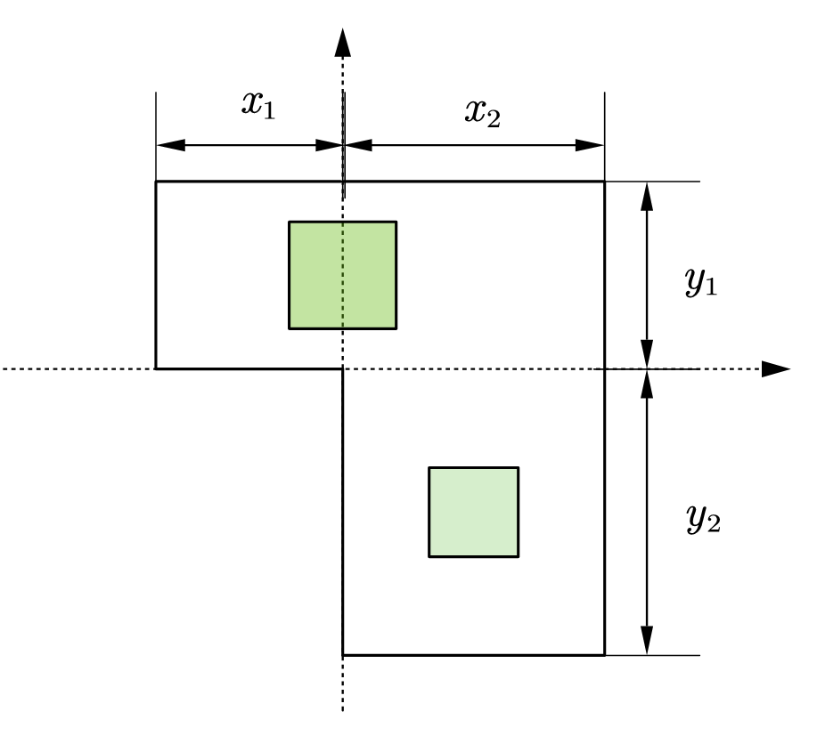
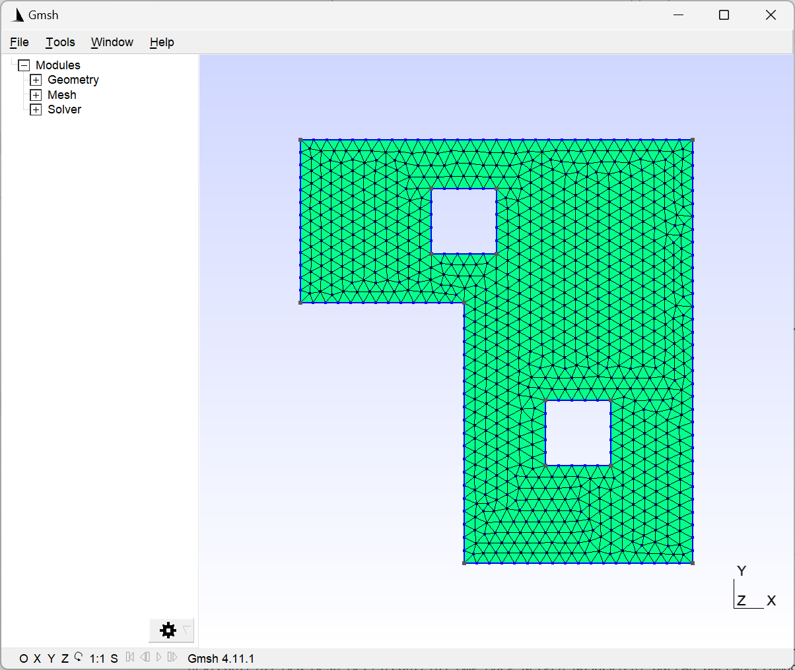
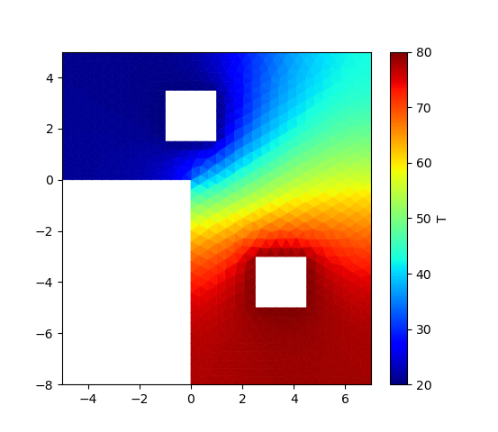

#! https://zhuanlan.zhihu.com/p/614915353
# FiPy求解稳态热传导问题

本文使用FiPy这个库，求解芯片工作时的温度分布。项目地址(https://github.com/cjyyx/CFD_Learning/tree/main/CFD%E8%BD%AF%E4%BB%B6%E5%AD%A6%E4%B9%A0/FiPy/Clip)

## 物理建模



如图，芯片工作时，有热源和冷源，且其外部边界是绝热的。

我们用python调用gmsh库生成芯片的网格，代码地址(https://github.com/cjyyx/CFD_Learning/blob/main/CFD%E8%BD%AF%E4%BB%B6%E5%AD%A6%E4%B9%A0/FiPy/Clip/Mesh.py)




稳态热传导问题的偏微分方程为

$$
\Delta T=0
$$

其中$T$是温度场。

并且设立边界条件，固定冷源温度为$T_{\text{cool}}$，热源温度为$T_{\text{hot}}$；芯片外部是绝热的，即温度的梯度为0。

## 代码编写

首先，声明需要的库，设定相关参数，导入模型

```python
import numpy as np
from fipy import *
from fipy.tools import numerix

T_hot = 80.
T_cool = 20.

mesh = Gmsh2D("clip.msh2")
```

声明网格变量，并设定边界条件

```python
T = CellVariable(name="T",
                 mesh=mesh,
                 value=T_cool)

T.constrain(T_hot, mesh.physicalFaces["hot"])
T.constrain(T_cool, mesh.physicalFaces["cool"])
T.faceGrad.constrain(0., mesh.physicalFaces["edge"])
```

可视化

```python
viewer = Viewer(
    vars=T,
    datamin=T_cool,
    datamax =T_hot
    )
```

求解稳态热传导方程

```python
eq = DiffusionTerm()
eq.solve(var=T)
```

可视化保存结果至result.png

```python
viewer.plot("result.png")
```

最终结果



## 参考资料

1. examples.diffusion.mesh20x20, https://www.ctcms.nist.gov/fipy/examples/diffusion/generated/examples.diffusion.mesh20x20.html
2. Gmsh 4.11.1, https://gmsh.info/doc/texinfo/gmsh.html