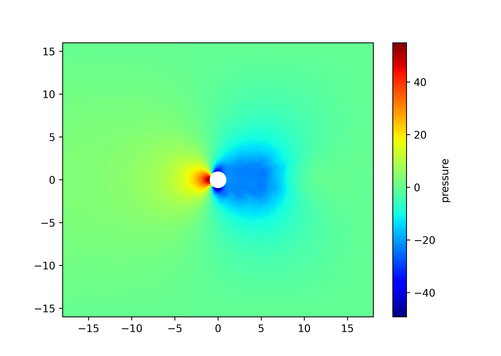
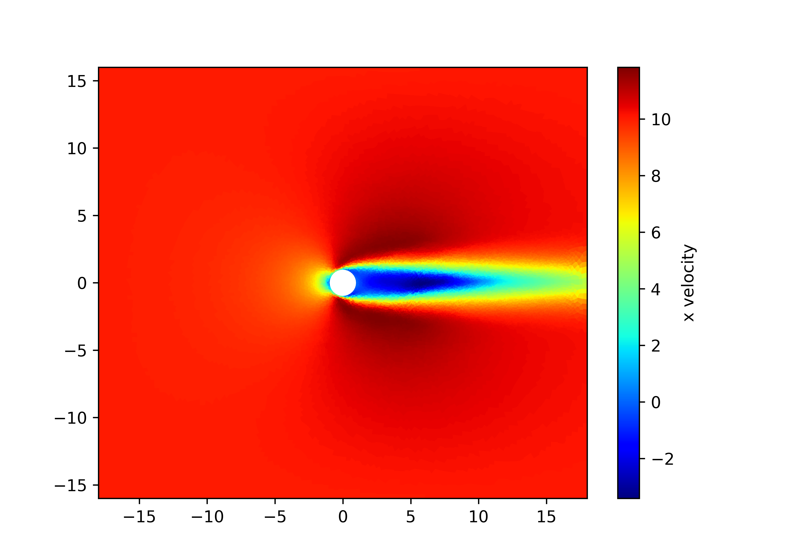
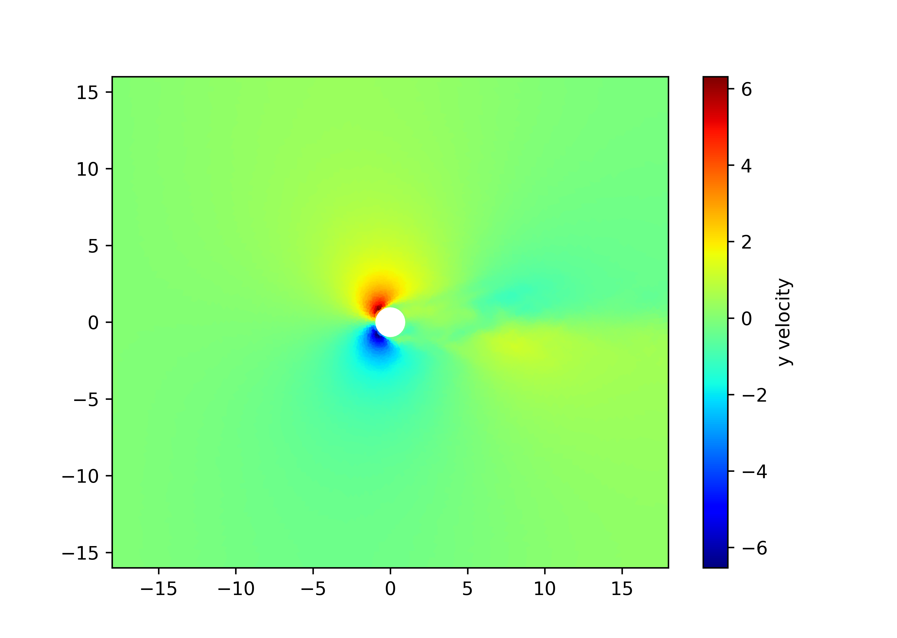

#! https://zhuanlan.zhihu.com/p/617614907

# Gmsh 和 FiPy 求解稳态圆柱绕流

本项目的源码保存在 github 仓库(https://github.com/cjyyx/CFD_Learning/tree/main/CFD%E8%BD%AF%E4%BB%B6%E5%AD%A6%E4%B9%A0/FiPy/cylinder)。如果下载整个目录，可以直接运行 `SIMPLE.py`，结果如图



<!--  -->

## 网格生成

采用 Gmsh 的 python 接口生成网格，源码为 `Mesh.py`，生成网格如图


## 控制方程组

假设流体是不可压缩流，则流体满足如下控制方程组

**连续性方程**

$$
\nabla \cdot \vec{u}=0
$$

**动量方程**

$$
\rho \left(\vec{u} \cdot \nabla \right) \vec{u} = \nabla \cdot(\mu \nabla \vec{u}) -\nabla p
$$


其中，$\vec{u} = (u_{x} , u_{y})$ 表示流场，$p$ 表示压力场，$\rho$ 表示密度，$\mu$ 表示粘度。

将上述方程展开，有

连续性方程

$$
\frac{\partial u_{x}}{\partial x} + \frac{\partial u_{y}}{\partial y} = 0
$$

动量方程 $x$ 方向分量

$$
\rho \left(u_{x} \frac{\partial u_{x}}{\partial x} + u_{y} \frac{\partial u_{x}}{\partial y} \right) = \frac{\partial}{\partial x}\left(\mu \frac{\partial u_{x}}{\partial x}\right) + \frac{\partial}{\partial y}\left(\mu \frac{\partial u_{x}}{\partial y}\right) -\frac{\partial p}{\partial x}
$$

动量方程 $y$ 方向分量

$$
\rho \left(u_{x} \frac{\partial u_{y}}{\partial x} + u_{y} \frac{\partial u_{y}}{\partial y} \right) = \frac{\partial}{\partial x}\left(\mu \frac{\partial u_{y}}{\partial x}\right) + \frac{\partial}{\partial y}\left(\mu \frac{\partial u_{y}}{\partial y}\right) -\frac{\partial p}{\partial y}
$$

## SIMPLE 算法

如上面的控制方程组所示，不可压缩流的控制方程组是非线性且耦合的，即流场 $\vec{u}$ 非齐次，流场与压力场相耦合。

SIMPLE 算法的核心思想是把流场拆分为网格面上的流场 $\vec{v}$，网格内部的流场 $\vec{u}$，压力场 $p$。先假设压力场 $p$ 和网格面上的流场 $\vec{v}$ 已知，求网格内部的流场 $\vec{u}$，再通过求得的流场求网格面上的流场，进而求压力场，如此迭代至较高精度。

因此，我们可以在 FiPy 中声明变量

```python
U = 10.

Vx = CellVariable(mesh=mesh, name="x velocity", value=U)
Vy = CellVariable(mesh=mesh, name="y velocity", value=0.)

Vf = FaceVariable(mesh=mesh, rank=1)
Vf.setValue((Vx.faceValue, Vy.faceValue))

p = CellVariable(mesh=mesh, name="pressure", value=0.)
pc = CellVariable(mesh=mesh, value=0.) # 压力修正项，后面会提到
```

首先，我们假设压力场已知，为 $p^{*}$，且各网格面上的流场已知，为 $\vec{v}$，则可离散化动量方程，求出网格内部的流场 $\vec{u}^{*}$

$$
a_{P} \vec{u}_{P}^{*}=\sum_{f} a_{A} \vec{u}_{A}^{*}-V_{P}\left(\nabla p^{*}\right)_{P}
$$

其中 $a_{P}, a_{A}$ 都可通过网格面上的流场 $\vec{v}$ 和网格的几何信息计算。$V_{P}$ 是控制体的体积，$\left(\nabla p^{*}\right)_{P}$ 是一个源项，通过压力场 $p^{*}$ 计算。

在 FiPy 中的代码如下

```python
mu = 0.1
rho = 1.

Vx_Eq = \
    UpwindConvectionTerm(coeff=Vf, var=Vx) * rho == \
    DiffusionTerm(coeff=mu, var=Vx) - \
    ImplicitSourceTerm(coeff=1.0, var=p.grad[0])
Vy_Eq = \
    UpwindConvectionTerm(coeff=Vf, var=Vy) * rho == \
    DiffusionTerm(coeff=mu, var=Vy) - \
    ImplicitSourceTerm(coeff=1.0, var=p.grad[1])
```

对这个方程进行求解

```python
Rv = 0.8
apx = CellVariable(mesh=mesh, value=1.)
apy = CellVariable(mesh=mesh, value=1.)

Vx_Eq.cacheMatrix()
Vx_Eq.cacheRHSvector()
xres = Vx_Eq.sweep(var=Vx, underRelaxation=Rv)
xmat = Vx_Eq.matrix
xrhs = Vx_Eq.RHSvector
apx[:] = numerix.asarray(xmat.takeDiagonal())

Vy_Eq.cacheMatrix()
Vy_Eq.cacheRHSvector()
yres = Vy_Eq.sweep(var=Vy, underRelaxation=Rv)
ymat = Vy_Eq.matrix
yrhs = Vy_Eq.RHSvector
apy[:] = numerix.asarray(ymat.takeDiagonal())
```

其中，`xmat, ymat` 是 $a_{P}, a_{A}$ 构成的系数矩阵；`xrhs, yrhs` 是 $-V_{P}\left(\nabla p^{*}\right)_{P}$ 构成的列向量；`apx, apy` 是系数矩阵对角线上的值，即 $a_{P}$ 构成的列向量；`xres, yres` 是残差，与迭代的收敛相关。

事实上，`xmat, ymat` 这两个矩阵是完全一致的，即

```python
xmat.matrix.data == ymat.matrix.data # True
```

且当欠松弛系数 `Rv = 1.` 时，有

```python
Vc = mesh.cellVolumes

xrhs == (-p.grad[0].value * Vc) # True
yrhs == (-p.grad[1].value * Vc) # True
```

总之，我们通过 `p` 和 `Vf` 求出了 `Vx, Vy`，下面可以通过 `Vx, Vy` 更新 `Vf`

```python
Vf.setValue((Vx.faceValue, Vy.faceValue))
```

值得注意的是，直接通过几何插值获取网格面上的流场，可能会造成网格问题，更好的方案是利用 Rhie-Chow 插值


```python
Vcf = CellVariable(mesh=mesh, value=Vc).faceValue

presgrad = p.grad
facepresgrad = presgrad.faceValue
Vf[0] = Vx.faceValue + Vcf / apx.faceValue * \
    (presgrad[0].faceValue-facepresgrad[0])
Vf[1] = Vy.faceValue + Vcf / apx.faceValue * \
    (presgrad[1].faceValue-facepresgrad[1])
```

接下来，可以通过流场来更新压力场。当然我们不能只靠动量方程，还要结合连续性方程。我们假设精确的流场和压力场分别为

$$
\vec{u} = \vec{u}^{\ast} + \vec{u}^{\prime}
$$

$$
p = p^{\ast} + p^{\prime}
$$

将精确值代入离散动量方程和连续性方程，有

$$
a_{P} \left(\vec{u}^{*} + \vec{u}^{\prime}\right)_{P} = \sum_{f} a_{A} \left(\vec{u}^{*} + \vec{u}^{\prime}\right)_{A} - V_{P}\left[\nabla \left(p^{*} + p^{\prime}\right)\right]_{P}
$$

$$
\nabla \cdot \vec{u}^{*}+\nabla \cdot \vec{u}^{\prime}=0
$$

由于 $\vec{u}_{P}^{*}$ 已经满足离散动量方程，则有

$$
a_{P} \vec{u}_{P}^{\prime}=\sum_{f} a_{A} \vec{u}_{A}^{\prime}-V_{P}\left(\nabla p^{\prime}\right)_{P}
$$

忽略 $\sum\limits_{f} a_{A} \vec{u}_{A}^{\prime}$ 项（大概这个忽略不会对最终的结果造成太大的影响吧），有

$$
\vec{u}_{P}^{\prime}=-\frac{V_{P}\left(\nabla p^{\prime}\right)_{P}}{a_{P}}
$$

代入连续性方程，可得

$$
\nabla \frac{V_{P}}{a_{P}} \cdot \nabla p^{\prime}=\nabla \cdot \vec{u}^{*}
$$

该方程的形式为扩散方程，因此相应的代码为

```python
coeff = (
    1. / (
        apx.faceValue
        * mesh._faceAreas
        * mesh._cellDistances
    )
)
pc_Eq = \
    DiffusionTerm(coeff=coeff, var=pc) \
    - Vf.divergence
```

求解，然后可以更新压力场

```python
pcres = pc_Eq.sweep(var=pc)
p.setValue(p + Rp * pc)
```

其中 `Rp` 是欠松弛系数，用来控制收敛速度和稳定性。

接下来可以根据 $\vec{u} = \vec{u}^{\ast} + \vec{u}^{\prime}$ 更新流场

```python
Vx.setValue(Vx-(Vc*pc.grad[0])/apx)
Vy.setValue(Vy-(Vc*pc.grad[1])/apx)

presgrad = p.grad
facepresgrad = presgrad.faceValue
Vf[0] = Vx.faceValue + Vcf / apx.faceValue * \
    (presgrad[0].faceValue-facepresgrad[0])
Vf[1] = Vy.faceValue + Vcf / apx.faceValue * \
    (presgrad[1].faceValue-facepresgrad[1])
```

## 边界条件

对于圆柱绕流，比较合适的边界条件组合是

- 进口固定速度，压力零梯度
- 出口速度零梯度，压力固定值
- 壁面速度为零，压力零梯度

相应的，代码为

```python
inletFace = mesh.physicalFaces["inlet"]
outletFace = mesh.physicalFaces["outlet"]
cylinderFace = mesh.physicalFaces["cylinder"]
top_bottomFace = mesh.physicalFaces["top"] | mesh.physicalFaces["bottom"]

Vx.constrain(U, inletFace)
Vy.constrain(0., inletFace)
p.faceGrad.constrain(0., inletFace)
pc.faceGrad.constrain(0., inletFace)

Vx.faceGrad.constrain(0., outletFace)
Vy.faceGrad.constrain(0., outletFace)
p.constrain(0., outletFace)
pc.constrain(0., outletFace)

Vx.constrain(0., cylinderFace)
Vy.constrain(0., cylinderFace)
p.faceGrad.constrain(0., cylinderFace)
pc.faceGrad.constrain(0., cylinderFace)

Vx.faceGrad.constrain(0., top_bottomFace)
Vy.faceGrad.constrain(0., top_bottomFace)
p.constrain(0., top_bottomFace)
pc.constrain(0., top_bottomFace)
```

## 稳定性问题

### 雷诺数

雷诺数（Reynolds number）是描述流体运动状态的一个无量纲数。

其定义为

$$
Re = \frac{\rho U L}{\mu}
$$

其中，$\rho$ 是流体密度，$U$ 是流体速度，$L$ 是特征长度，$\mu$ 是粘度。

当雷诺数大于一定的临界值时，流体在管道中的流动状态将从稳定的层流转变为不稳定的湍流，这时候不存在稳态解。

因此，在求解稳态圆柱绕流时，如果雷诺数过大，则在物理上不应该存在稳态解，这在求解过程中，表现为残差收敛过慢或无法收敛，甚至发生残差爆炸。

当然，可以通过一系列手段，强行求出稳态解。

### RuntimeError: Factor is exactly singular

发生这个错误是因为离散动量方程的系数矩阵是奇异的，想要降低该错误发生的概率，可以采取以下措施

- 使用更精细网格
- 降低 Rv
- 提高雷诺数

### 残差爆炸

主要是因为雷诺数过高。避免残差爆炸可以采取以下措施

- 使用更精细网格
- 降低 Rp
- 设置阈值，避免流场变量溢出，即

```python
V_limit = 1e2
p_limit = 2e3

Vx[Vx.value > V_limit] = V_limit
Vx[Vx.value < -V_limit] = -V_limit

Vy[Vy.value > V_limit] = V_limit
Vy[Vy.value < -V_limit] = -V_limit

Vf[Vf.value > V_limit] = V_limit
Vf[Vf.value < -V_limit] = -V_limit

p[p.value > p_limit] = p_limit
p[p.value < -p_limit] = -p_limit
```

### 比较稳定的求解方法

尽可能使用更精细网格。

在迭代的开始阶段，调整雷诺数，使雷诺数较低；使 `Rv, Rp` 较低。从而确保迭代的稳定性。

在迭代过程中，逐渐提升雷诺数至目标值；提升 `Rv, Rp` 以加快求解速度，但确保  `Rv, Rp` 小于 1。

当残差稳定时，判断已经收敛，退出求解。

