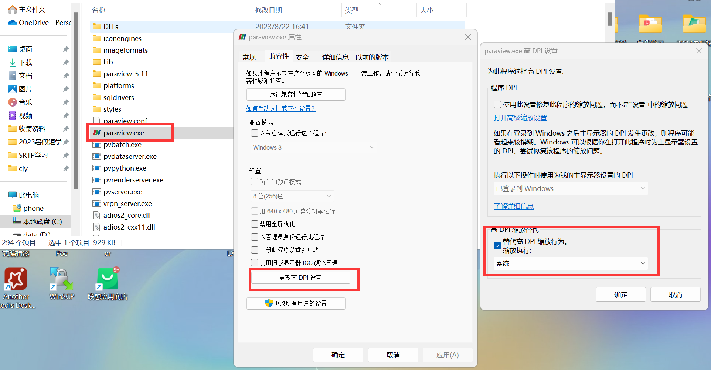

#! https://zhuanlan.zhihu.com/p/660892102
# paraview 安装

## apt 安装

```bash
sudo apt install paraview
```

## 安装包安装

参考 https://blog.csdn.net/weixin_47492286/article/details/127210382

下载 https://www.paraview.org/download/

```bash
sudo tar -zxvf ParaView-xxx -C /usr/local/
cd /usr/local/
sudo mv ParaView-xxx paraview
echo "alias paraview=/usr/local/paraview/bin/paraview" >> ~/.bashrc
source ~/.bashrc
```

## 利用 windows 系统中的 paraview

wsl 中使用 paraview 会遇到以下错误

```log
/usr/local/paraview/bin/paraview-real: error while loading shared libraries: libGL.so.1: cannot open shared object file: No such file or directory
```

或

```log
Loguru caught a signal: SIGSEGV
Stack trace:
1       0x7fff5bd5c070 [0x7fff5bd5c070]
0       0x7f5124e53520 /usr/bin/../lib/x86_64-linux-gnu/libc.so.6(+0x42520) [0x7f5124e53520]
(   3.536s) [paraview        ]                       :0     FATL| Signal: SIGSEGV
Segmentation fault
```

**因此可以尝试调用 windows 系统中的 paraview**

下载 https://www.paraview.org/download/

假设 windows 安装路径 `D:\ProgramFiles\ParaView\binparaview.exe` ，注意**路径不要有空格**

接下来在 wsl 中运行以下命令

```bash
echo "alias paraview=/mnt/d/ProgramFiles/ParaView/bin/paraview.exe" >> ~/.bashrc
source ~/.bashrc
```

如果要使用 paraFoam，可以先运行

```bash
sudo nano /usr/lib/openfoam/openfoam2306/bin/paraFoam
```

然后在 `#!/bin/sh` 这行后加上

```bash
alias paraview=/mnt/d/ProgramFiles/ParaView/bin/paraview.exe
```

<!-- 如果有缩放问题，可以进行下面设置

 -->

另一种使用方式

```bash
foamToVTK -case cavity -ascii
cmd.exe /C D:/ProgramFiles/ParaView/bin/paraview.exe --data=//wsl.localhost/Ubuntu$(pwd)/cavity/VTK/cavity.vtm.series
```

## 判断安装成功

```bash
paraview
```