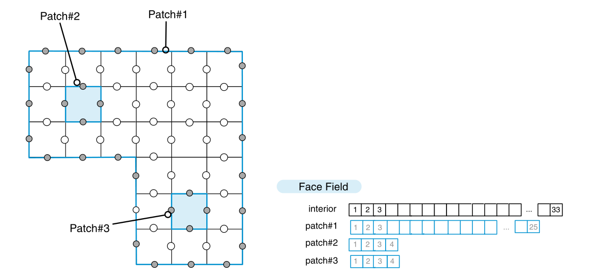

#! https://zhuanlan.zhihu.com/p/603476900
# 有限体积法（一）离散过程

本文包括F. Moukalled 写的The Finite Volume Method in Computational Fluid Dynamics- An Advanced Introduction with OpenFOAM and Matlab 这本书的Chapter 4 的内容。

本文介绍了离散化过程的不同步骤，包括：
(i)几何域建模和感兴趣的物理现象；
(ii)将建模的几何域离散成形成计算域的网格或网格（此过程也称为网格化或域离散化，导致一组不重叠的元素，也由单元表示，覆盖计算域）；
(iii)数值或方程离散化，将控制物理过程的守恒偏微分方程集转换为定义在计算域的每个元素上的等价代数方程系统；
(iv)使用迭代求解器求解结果集的方程，以产生中间或最终解场。

## 几何和物理建模

以处理器散热为例。heat sink是散热器，microprocessor是处理器，它们被安放在基座上。下图为示意图。

然后进行建模。几何区域是一个二维图形，而且是双连通的。边界条件是内部的边界是固定温度，外部边界绝热。物理模型是热传导方程。该偏微分方程的物理量是温度。一个物理量加上一个偏微分方程，刚好是完备的。

热传导方程为
$$
-\nabla \cdot(k \nabla T)=\dot{q}\tag{1-1}
$$

## 几何域离散化

也就是将域细分为**离散的、不重叠**的单元或元素，这些单元或元素完全填充计算域，以产生网格或网格系统。在所有情况下，网格都是由一组**顶点定义并以面为界**的离散元素组成。这些离散元素也被称为**控制体**（个人理解）。

网格划分有许多方式，网格信息的存贮数据结构各不相同。

每个网格都有各自的物理量。假如有$N$个网格，那么温度$T$在几何平面上的分布就可以用一个容量为$N$的数组表示。

## 网格拓扑

在计算过程中，网格信息以**连通性列表**的形式表示。

## 方程离散化

前面说到温度$T$在几何平面上的分布离散化成容量为$N$的数组。现在要求出这$N$个值，显然需要$N$个方程。而把物理方程应用到这$N$个网格上就有了$N$个方程。

简单起见，把物理偏微分方程转换成线性方程，这就获得了一个线性方程组
$$
\bm{A}[\bm{T}]=\bm{b}\tag{1-2}
$$
显然能够解这个线性方程组，于是就获得了偏微分方程的数值解。

现在问题是如何把物理偏微分方程转换成线性方程？

现在研究控制体$C$。将热传导方程作用到该控制体上，并转化为积分形式
$$
-\iint_{V_{C}} \nabla \cdot(k \nabla T) \text{d} V=\iint_{V_{C}} \dot{q} \text{d} V\tag{1-3}
$$

等号左边应用散度定理，右边取平均值，得
$$
-\int_{S_{C}}(k \nabla T) \cdot \text{d} \mathbf{S}=\dot{q}_{C} V_{C}\tag{1-4}
$$

这实际上是控制体$C$的热平衡方程。由于控制体是四边形，故可将等号右边的积分展开，得
$$
-\sum_{f \sim n b(C)}(k \nabla T)_{f} \cdot \mathbf{S}_{f}=\dot{q}_{C} V_{C}\tag{1-5}
$$

这实际上是一个近似，用局部值代替整体。接下来继续近似等号左边
$$
\begin{aligned}
(k \nabla T)_{f} \cdot \mathbf{S}_{f}&=k S_{f}(\nabla T)_{f}\cdot \mathbf{n}_{f}\\
&=k S_{f}\left(\frac{\text{d}T}{\text{d}\mathbf{n}}\right)_{f}\\
&\approx k S_{f} \frac{T_{F}-T_{C}}{|FC|}
\end{aligned}\tag{1-6}
$$

其中$S_{f}$是网格边界的边长，$T_{F},T_C$是各控制体内的温度，$|FC|$代表两控制体中心的距离。显然除$T$外其它已知。

等号右边与温度随时间的变化有关。这里只求稳态解，故取0
$$
\dot{q}_{C} V_{C}=0\tag{1-7}
$$

对于边界上的控制体，上面的方法也适用。

综上所述，已经可以把偏微分方程转换成线性方程了。

## 离散方程的解

回顾之前得到的线性方程组(1-2)，其求解是相当容易的
$$
[T]=\mathbf{A}^{-1} \mathbf{b}\tag{1-8}
$$

值得注意的是，应用矩阵逆直接求解计算量巨大，因此对特定问题要进行特定优化。

### 迭代方法

*这其实是数值计算的内容，懒得写了~*

## 总结

本文概述了离散化过程，重点介绍了开发CFD代码所需的基本要素。接下来的文章将逐一分析这些成分，同时开发学习工业开源CFD库，即OpenFOAM。

[目录](https://zhuanlan.zhihu.com/p/599909213)