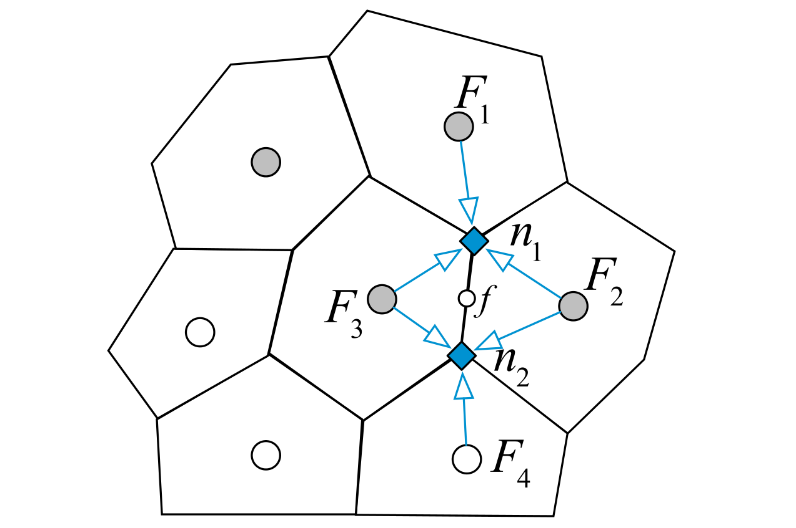
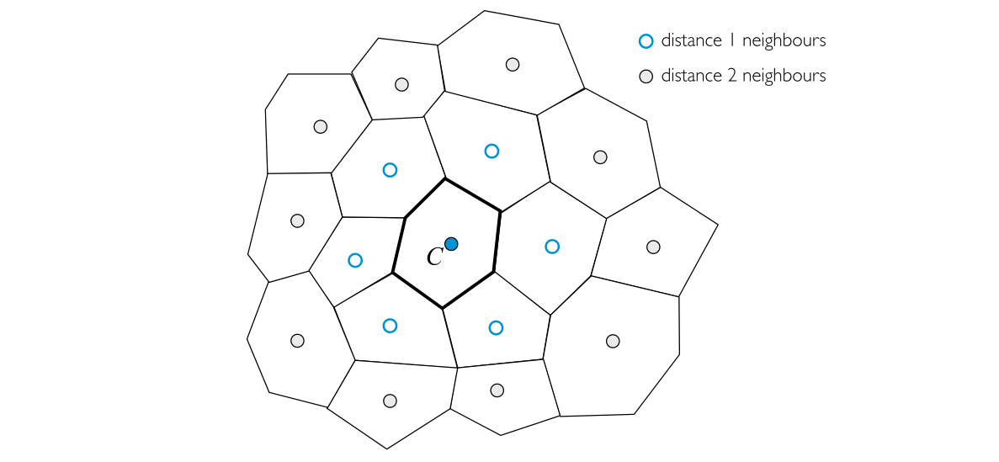

#! https://zhuanlan.zhihu.com/p/604163616
# 有限体积法（三）梯度的离散化

本文包括F. Moukalled 写的The Finite Volume Method in Computational Fluid Dynamics- An Advanced Introduction with OpenFOAM and Matlab 这本书的Chapter 9.2-9.5 的内容。

回顾一下，所谓离散化就是用每个控制体上的变量$\phi$，密度$\rho$，流速$\mathbf{v}$乃至不同时间步的值来代表某项，或偏微分方程。这种转换存在精度的损失，可以用阶数衡量。并且$\phi,\rho,\mathbf{v}$一般表示为控制体中心的值或控制体内的平均值。

梯度$\nabla \phi$广泛出现在流体力学方程中，比如扩散项和源项就包含了梯度。因此梯度的离散化就非常必要。

## 格林-高斯梯度

这是计算梯度最广泛使用的方法之一。核心就是格林公式。
$$
\iiint_{V} \nabla \phi \text{d} V=\oint_{\partial V} \phi \text{d} \mathbf{S} \tag{3-1}
$$

将其作用到控制体$C$上，并离散化，有
$$
\nabla \phi_{C}=\frac{1}{V_{C}} \sum_{f \sim nb(C)} \phi_{f} \mathbf{S}_{f} \tag{3-2}
$$
其中$\nabla\phi_{C}$是控制体内$\nabla\phi$的平均值，$\phi_{f}$是面$f$上$\phi$的平均值。显然想要知道$\nabla\phi_{C}$，就要计算$\phi_{f}$的值。

计算的方法分为两种，一种是基于面的紧凑型Compact Stencil，一种是基于顶点的扩展型Extended Stencil。

### 紧凑型Compact Stencil

记与面$f$相邻的控制体为$F$和$C$，则可通过**插值**计算$\phi_{f}$的近似值
$$
\phi_{f}=g_{C} \phi_{C}+\left(1-g_{C}\right) \phi_{F} \tag{3-3}
$$
其中$g_{C}$是几何权重系数
$$
g_{C}=\frac{\left\|\mathbf{r}_{F}-\mathbf{r}_{f}\right\|}{\left\|\mathbf{r}_{F}-\mathbf{r}_{C}\right\|}=\frac{d_{F f}}{d_{F C}} \tag{3-4}
$$

然而，只有当$CF$当连线与高斯积分点$f$重合时，才会得到$\phi_{f}$的二阶近似。当然可以通过添加修正和迭代法提高精度，但是我看不懂，这里就不写了~

<!-- 如图，记记与面$f$相邻的控制体为$F$和$C$；$F,C$为控制体的中心；$f$为面上的高斯积分点；$CF$连线与面交于点$f^{\prime}$。

则可计算$\phi_{f}$的近似，该近似有二阶精度
$$
\phi_{f} =\phi_{f^{\prime}}+(\nabla \phi)_{f^{\prime}}\cdot\left(\mathbf{r}_{f}-\mathbf{r}_{f^{\prime}}\right) \tag{3-3}
$$

而$\phi_{f^{\prime}},(\nabla \phi)_{f^{\prime}},\mathbf{r}_{f^{\prime}}$依靠$g_{C}$通过插值近似，该近似有二阶精度。即
$$
\begin{array}{l}
\phi_{f^{\prime}}=g_{C} \phi_{C}+\left(1-g_{C}\right) \phi_{F}\\
(\nabla \phi)_{f^{\prime}}=g_{C} (\nabla \phi)_{C}+\left(1-g_{C}\right) (\nabla \phi)_{F}\\
\mathbf{r}_{f^{\prime}}=g_{C} \mathbf{r}_{C}+\left(1-g_{C}\right) \mathbf{r}_{F}\\
\end{array}\tag{3-4}
$$

其中$g_{C}$是几何权重系数
$$
g_{C}=\frac{\left\|\mathbf{r}_{F}-\mathbf{r}_{f}\right\|}{\left\|\mathbf{r}_{F}-\mathbf{r}_{C}\right\|}=\frac{d_{F f}}{d_{F C}} \tag{3-5}
$$

综上
$$
\phi_{f}=g_{C}\left\{\phi_{C}+(\nabla \phi)_{C} \cdot\left(\mathbf{r}_{f}-\mathbf{r}_{C}\right)\right\}+\left(1-g_{C}\right)\left\{\phi_{F}+(\nabla \phi)_{F} \cdot\left(\mathbf{r}_{f}-\mathbf{r}_{F}\right)\right\} \tag{3-6}
$$
 -->

### 扩展型Extended Stencil

如下图，面$f$上的$\phi_{f}$，可以由顶点$n$上的$\phi_{n}$**加权平均近似**；而$\phi_{n}$又可以由相邻的控制体$F$内的$\phi_{F}$**加权平均近似**。其中权重可以用距离的倒数表示。

用公式表示就是
$$
\phi_{f}=\frac{\sum\limits_{n \sim nb(f)} \frac{\phi_{n}}{\left\|\mathbf{r}_{f}-\mathbf{r}_{n}\right\|}}{\sum\limits_{n \sim nb(f)} \frac{1}{\left\| \mathbf{r}_{f}-\mathbf{r}_{n} \right\|}} \tag{3-5}
$$

$$
\phi_{n}=\frac{\sum\limits_{f \sim NB(n)} \frac{\phi_{F}}{\left\|\mathbf{r}_{n}-\mathbf{r}_{F}\right\|}}{\sum\limits_{f \sim NB(n)} \frac{1}{\left\|\mathbf{r}_{n}-\mathbf{r}_{F}\right\|}} \tag{3-6}
$$

## 最小二乘梯度

最小二乘梯度实际上就是最小二乘法的思想的应用，即寻找一个非负的指标，当且仅当所求情形实现时，该指标值为0，于是可以使偏导为0求出所求。

假设存在一个控制体$C$，其周围的控制体记为$F$，则有如下近似关系
$$
\phi_{F}=\phi_{C}+(\nabla \phi)_{C} \cdot\left(\mathbf{r}_{F}-\mathbf{r}_{C}\right) \tag{3-7}
$$

于是便可以设定指标$G_C$
$$
G_{C}=\sum_{k=1}^{NB(C)}\left\{w_{k}\left[\phi_{F_{k}}-\left(\phi_{C}+\nabla \phi_{C} \cdot \mathbf{r}_{C F_{k}}\right)\right]^{2}\right\} \tag{3-8}
$$
其中$NB(C)$表示对$C$周围控制体的遍历，$w_{k}$是权重系数，$\mathbf{r}_{C F_{k}}=\mathbf{r}_{F_k}-\mathbf{r}_{C}$。

显然$G_C\ge 0$，且$G_C$的值越小，$(\nabla \phi)_{C}$应该越精确。

由于
$$
(\nabla \phi)_{C}=\left(\frac{\partial \phi}{\partial x}\right)_{C} \mathbf{i} + \left(\frac{\partial \phi}{\partial y}\right)_{C} \mathbf{j} + \left(\frac{\partial \phi}{\partial z}\right)_{C} \mathbf{k} \tag{3-9}
$$

则为了使$G_C$取最小值，有
$$
\frac{\partial G_{C}}{\partial\left(\frac{\partial \phi}{\partial x}\right)}=\frac{\partial G_{C}}{\partial\left(\frac{\partial \phi}{\partial y}\right)}=\frac{\partial G_{C}}{\partial\left(\frac{\partial \phi}{\partial z}\right)}=0 \tag{3-10}
$$

展开，得
$$
\begin{array}{l}
\sum\limits_{k=1}^{N B(C)}\left\{2 w_{k} \Delta x_{k}\left[-\Delta \phi_{k}+\Delta x_{k}\left(\frac{\partial \phi}{\partial x}\right)_{C}+\Delta y_{k}\left(\frac{\partial \phi}{\partial y}\right)_{C}+\Delta z_{k}\left(\frac{\partial \phi}{\partial z}\right)_{C}\right]\right\}=0 \\
\sum\limits_{k=1}^{N B(C)}\left\{2 w_{k} \Delta y_{k}\left[-\Delta \phi_{k}+\Delta x_{k}\left(\frac{\partial \phi}{\partial x}\right)_{C}+\Delta y_{k}\left(\frac{\partial \phi}{\partial y}\right)_{C}+\Delta z_{k}\left(\frac{\partial \phi}{\partial z}\right)_{C}\right]\right\}=0 \\
\sum\limits_{k=1}^{N B(C)}\left\{2 w_{k} \Delta z_{k}\left[-\Delta \phi_{k}+\Delta x_{k}\left(\frac{\partial \phi}{\partial x}\right)_{C}+\Delta y_{k}\left(\frac{\partial \phi}{\partial y}\right)_{C}+\Delta z_{k}\left(\frac{\partial \phi}{\partial z}\right)_{C}\right]\right\}=0
\end{array} \tag{3-11}
$$
其中
$$
\begin{array}{l}
\Delta \phi_{k} =\phi_{F_{k}}-\phi_{C} \\
\Delta x_{k} =\mathbf{r}_{C F_{k}} \cdot \mathbf{i} \\
\Delta y_{k} =\mathbf{r}_{C F_{k}} \cdot \mathbf{j} \\
\Delta z_{k} =\mathbf{r}_{C F_{k}} \cdot \mathbf{k}
\end{array} \tag{3-12}
$$

当然方程（3-11）也可以写成矩阵形式
$$
\begin{array}{l}
{\left[\begin{array}{ccc}
\sum\limits_{k=1}^{N B(C)} w_{k} \Delta x_{k} \Delta x_{k} & \sum\limits_{k=1}^{N B(C)} w_{k} \Delta x_{k} \Delta y_{k} & \sum\limits_{k=1}^{N B(C)} w_{k} \Delta x_{k} \Delta z_{k} \\
\sum\limits_{k=1}^{N B(C)} w_{k} \Delta y_{k} \Delta x_{k} & \sum\limits_{k=1}^{N B(C)} w_{k} \Delta y_{k} \Delta y_{k} & \sum\limits_{k=1}^{N B(C)} w_{k} \Delta y_{k} \Delta z_{k} \\
\sum\limits_{k=1}^{N B(C)} w_{k} \Delta z_{k} \Delta x_{k} & \sum\limits_{k=1}^{N B(C)} w_{k} \Delta z_{k} \Delta y_{k} & \sum\limits_{k=1}^{N B(C)} w_{k} \Delta z_{k} \Delta z_{k}
\end{array}\right]\left[\begin{array}{l}
\left(\frac{\partial \phi}{\partial x}\right)_{C} \\
\left(\frac{\partial \phi}{\partial y}\right)_{C} \\
\left(\frac{\partial \phi}{\partial z}\right)_{C}
\end{array}\right]} \\
=\left[\begin{array}{l}
\sum\limits_{k=1}^{N B(C)} w_{k} \Delta x_{k} \Delta \phi_{k} \\
\sum\limits_{k=1}^{N B(C)} w_{k} \Delta y_{k} \Delta \phi_{k} \\
\sum\limits_{k=1}^{N B(C)} w_{k} \Delta z_{k} \Delta \phi_{k}
\end{array}\right] \\
\end{array} \tag{3-13}
$$

该方程只是线性方程组，可以轻松求解。

接下来是权重系数$w_{k}$的选择。一般情况下，权重系数是控制体间距离的倒数，或距离$n$次幂的倒数。
$$
w_{k}=\frac{1}{\left\|\mathbf{r}_{F_{k}}-\mathbf{r}_{C}\right\|}=\frac{1}{\sqrt{\Delta x_{F_{k}}^{2}+\Delta y_{F_{k}}^{2}+\Delta z_{F_{k}}^{2}}} \tag{3-14}
$$

$$
w_{k}=\frac{1}{\left\|\mathbf{r}_{F_{k}}-\mathbf{r}_{C}\right\|^{n}} \tag{3-15}
$$

## 面上的梯度插值

通过上面的内容，我们可以计算控制体内的梯度值。基于此，面上的梯度可以通过插值方法计算。而面插值方法实际上已经展示在格林-高斯梯度法中，即基于面的紧凑型方法和基于顶点的扩展型方法。

## 参考资料

1. F. Moukalled, The Finite Volume Method in Computational Fluid Dynamics- An Advanced Introduction with OpenFOAM and Matlab
2. 有限体积法：一图入门, https://zhuanlan.zhihu.com/p/378570075

[目录](https://zhuanlan.zhihu.com/p/599909213)

下一篇文章 [有限体积法（四）扩散项的离散化](https://zhuanlan.zhihu.com/p/604470110)