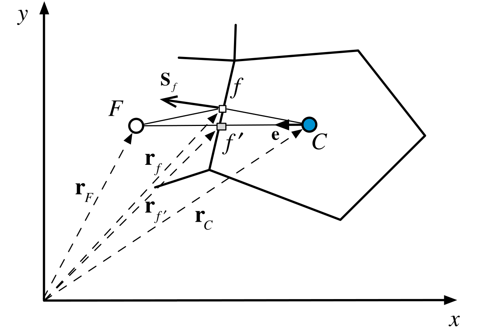

#! https://zhuanlan.zhihu.com/p/604163616
# 有限体积法（三）梯度的离散化

本文包括F. Moukalled 写的The Finite Volume Method in Computational Fluid Dynamics- An Advanced Introduction with OpenFOAM and Matlab 这本书的Chapter 9.2-9.5 的内容。

回顾一下，所谓离散化就是用每个控制体上的变量$\phi$，密度$\rho$，流速$\mathbf{v}$乃至不同时间步的值来代表某项，或偏微分方程。这种转换存在精度的损失，可以用阶数衡量。并且$\phi,\rho,\mathbf{v}$一般表示为控制体中心的值或控制体内的平均值。

梯度$\nabla \phi$广泛出现在流体力学方程中，比如扩散项和源项就包含了梯度。因此梯度的离散化就非常必要。

## 格林-高斯梯度

这是计算梯度最广泛使用的方法之一。核心就是格林公式。
$$
\iiint_{V} \nabla \phi \text{d} V=\oint_{\partial V} \phi \text{d} \mathbf{S} \tag{3-1}
$$

将其作用到控制体$C$上，并离散化，有
$$
\nabla \phi_{C}=\frac{1}{V_{C}} \sum_{f \sim nb(C)} \phi_{f} \mathbf{S}_{f} \tag{3-2}
$$
其中$\nabla\phi_{C}$是控制体内$\nabla\phi$的平均值，$\phi_{f}$是面$f$上$\phi$的平均值。显然想要知道$\nabla\phi_{C}$，就要计算$\phi_{f}$的值。

计算的方法分为两种，一种是基于面的紧凑型Compact Stencil，一种是基于顶点的扩展型Extended Stencil。

### 紧凑型Compact Stencil

记与面$f$相邻的控制体为$F$和$C$，则可计算$\phi_{f}$的近似值
$$
\phi_{f}=g_{C} \phi_{C}+\left(1-g_{C}\right) \phi_{F} \tag{3-3}
$$
其中$g_{C}$是几何权重系数
$$
g_{C}=\frac{\left\|\mathbf{r}_{F}-\mathbf{r}_{f}\right\|}{\left\|\mathbf{r}_{F}-\mathbf{r}_{C}\right\|}=\frac{d_{F f}}{d_{F C}} \tag{3-4}
$$

然而，只有当$CF$当连线与高斯积分点$f$重合时，才会得到$\phi_{f}$的二阶近似。

<未完待续>

## 参考资料

1. F. Moukalled, The Finite Volume Method in Computational Fluid Dynamics- An Advanced Introduction with OpenFOAM and Matlab
2. 有限体积法：一图入门, https://zhuanlan.zhihu.com/p/378570075
3. 陶文铨, 数值传热学（第2版）

[目录](https://zhuanlan.zhihu.com/p/599909213)