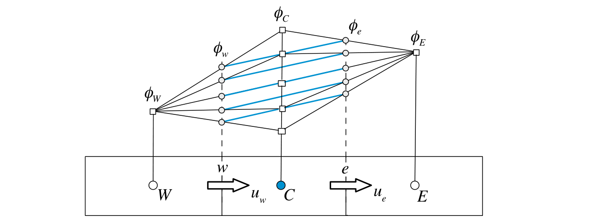
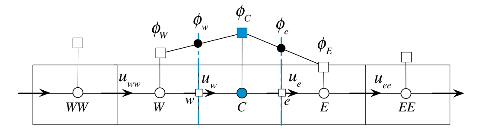

#! https://zhuanlan.zhihu.com/p/604518323
# 有限体积法（五）对流项的离散化

本文包括F. Moukalled 写的The Finite Volume Method in Computational Fluid Dynamics- An Advanced Introduction with OpenFOAM and Matlab 这本书的Chapter 11 的部分内容。

---

## 中心差分格式

对流项为
$$
\sum_{f \sim nb(C)}\left(\rho \mathbf{v} \phi \right)_{f} \cdot \mathbf{S}_{f} \tag{5-1}
$$

显然，$\left(\rho \mathbf{v} \phi \right)_{f}$的值可以通过插值获得。通过之前学过的**中心插值法**，有
$$
\phi_{f}=g_{C} \phi_{C}+\left(1-g_{C}\right) \phi_{F} \tag{5-2}
$$
其中$g_{C}$是几何权重系数
$$
g_{C}=\frac{\left\|\mathbf{r}_{F}-\mathbf{r}_{f}\right\|}{\left\|\mathbf{r}_{F}-\mathbf{r}_{C}\right\|}=\frac{d_{F f}}{d_{F C}} \tag{5-3}
$$

<!--  -->

但是，其精度相比扩散项会低很多。这是因为扩散同时受到上下游的影响，但对流过程是一个在流动方向上高度定向的过程。**中心差分格式对上游和下游的节点赋予相同的权重，这对对流过程来说是不合理的**。此外，中心差分格式会造成较大的不稳定性。详细的论述过程在Chapetr 11.4 ，也可以看[有限体积法（25）对流项离散（6）对流稳定性](https://zhuanlan.zhihu.com/p/372616075)。

## 迎风格式

迎风格式（upwind scheme）可以解决中心差分格式遇到的问题。迎风格式的核心思想就是：既然在对流项中$\phi_{f}$只受上游的影响，那么$\phi_{f}$**由上游的值外推求得而不是上下游插值求得**。

<未完待续>

## 参考资料

1. F. Moukalled, The Finite Volume Method in Computational Fluid Dynamics- An Advanced Introduction with OpenFOAM and Matlab
2. 有限体积法：一图入门, https://zhuanlan.zhihu.com/p/378570075

[目录](https://zhuanlan.zhihu.com/p/599909213)