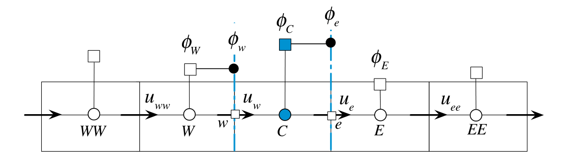
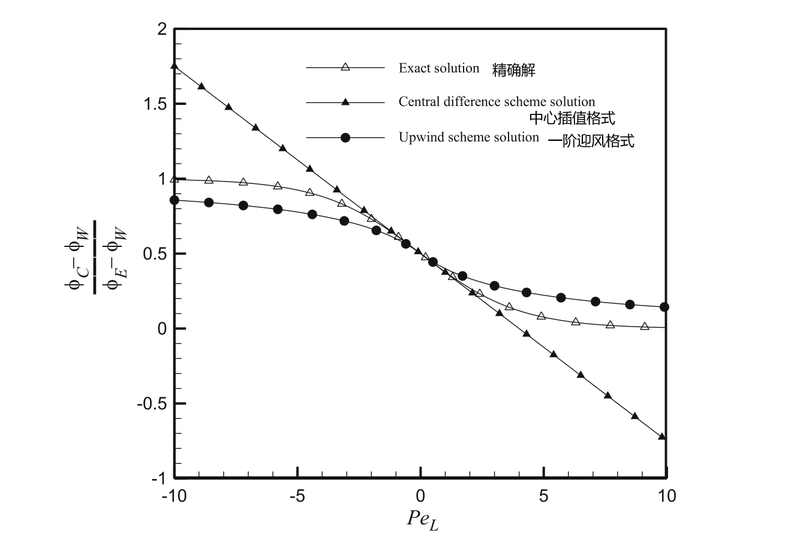
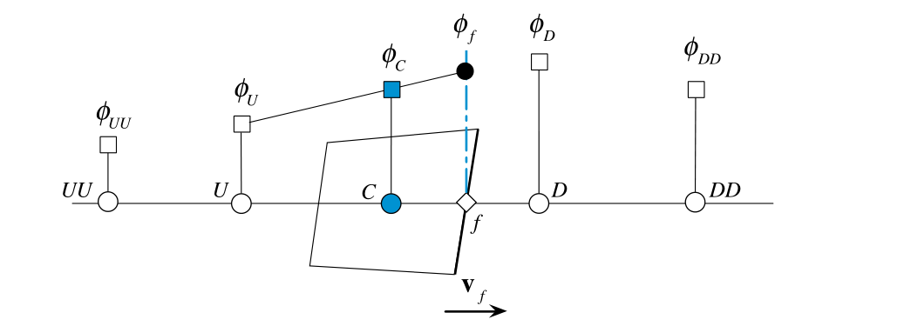
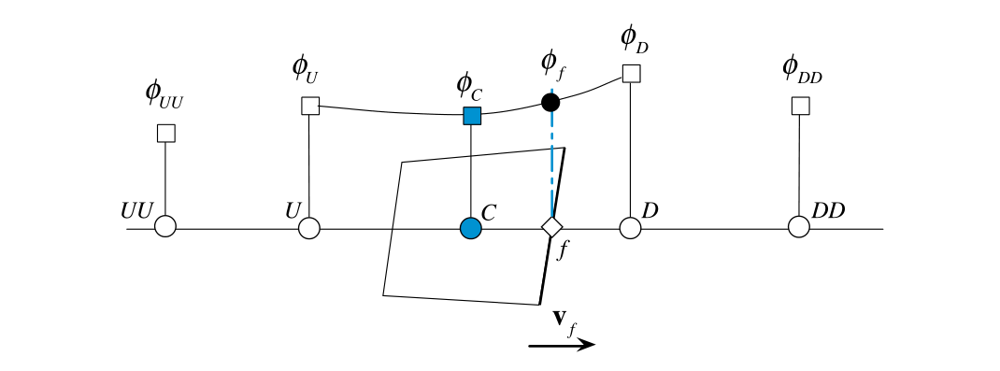
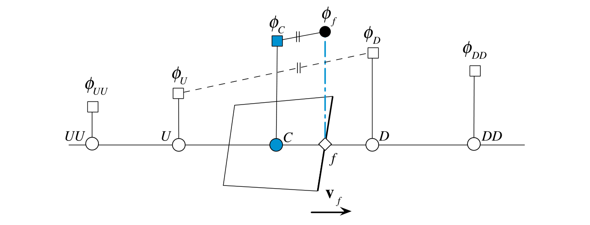
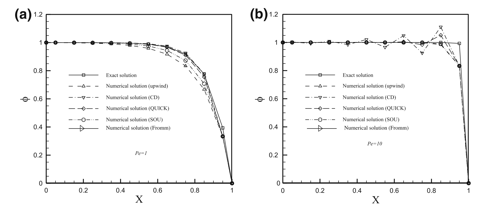

#! https://zhuanlan.zhihu.com/p/604518323
# 有限体积法（五）对流项的离散化

本文包括F. Moukalled 写的The Finite Volume Method in Computational Fluid Dynamics- An Advanced Introduction with OpenFOAM and Matlab 这本书的Chapter 11 的部分内容。

---

## 中心插值格式

对流项为
$$
\sum_{f \sim nb(C)}\left(\rho \mathbf{v} \phi \right)_{f} \cdot \mathbf{S}_{f} \tag{5-1}
$$

显然，$\left(\rho \mathbf{v} \phi \right)_{f}$的值可以通过插值获得。通过之前学过的**中心插值法**，有
$$
\phi_{f}=g_{C} \phi_{C}+\left(1-g_{C}\right) \phi_{F} \tag{5-2}
$$
其中$g_{C}$是几何权重系数
$$
g_{C}=\frac{\left\|\mathbf{r}_{F}-\mathbf{r}_{f}\right\|}{\left\|\mathbf{r}_{F}-\mathbf{r}_{C}\right\|}=\frac{d_{F f}}{d_{F C}} \tag{5-3}
$$

如图所示，流体在一维上流动，$W,C,E$三个控制体依次相邻，$\phi_{W},\phi_{C},\phi_{E}$是控制体的值，则$\phi_{w},\phi_{e}$都可用中心插值法离散化。

<!--  -->

但是，中心插值法用在对流项上的精度相比扩散项会低很多。这是因为扩散同时受到上下游的影响，但**对流过程是一个在流动方向上高度定向的过程**。中心差分格式对上游和下游的节点赋予相同的权重，这对对流过程来说是不合理的。此外，中心差分格式会造成较大的不稳定性。详细的论述过程在Chapetr 11.4 ，也可以看[有限体积法（25）对流项离散（6）对流稳定性](https://zhuanlan.zhihu.com/p/372616075)。

## 一维迎风格式

迎风格式（upwind scheme）可以解决中心差分格式遇到的问题。迎风格式的核心思想就是：既然在对流项中$\phi_{f}$只受上游的影响，那么$\phi_{f}$**由上游的值外推求得而不是上下游插值求得**。

### 一阶迎风格式

如图所示。图中黑色箭头为流体运动方向，那么对$C$来说，$W$为上游，$E$为下游。

对面$w$来说，$W$为上游，于是令$\phi_{w}=\phi_{W}$。同样，对面$e$来说，$C$为上游，令$\phi_{e}=\phi_{C}$。

该格式是一阶精度，故被称为一阶迎风格式。而且效果显著好于二阶精度的中心插值格式。

在书中，作者给出了一个只有三个网格的实例，比较了精确解、中心插值格式给出的数值解和一阶迎风格式给出的数值解，结果如上图所示。

### 二阶迎风格式

迎风格式的精度可以更高。二阶迎风格式利用了上游的两个控制体，得到了更高的精度。图中可以看得很清楚，就是一条直线往外延伸。

### QUICK格式

QUICK格式用了三个控制体，即上游的两个和下游的一个。二阶迎风格式是用一条直线拟合，而QUICK格式用二次函数拟合。

### FROMM格式

FROMM格式也利用了三个控制体。利用$U,D$计算斜率，并在$C$的基础上用同样的斜率外推。

书中也给出了以上格式在同一案例下的效果，如上图所示。

## 非结构网格的迎风格式

非结构网格情况下，一阶迎风格式依旧适用。难点是如何使用二阶迎风格式、QUICK格式、FROMM格式？

假设面$f$的上游为控制体$C$，则有

一阶迎风格式（Upwind scheme）
$$
\phi_{f}=\phi_{C} \tag{5-4}
$$

中心差分（Central difference）
$$
\phi_{f}=\phi_{C}+\nabla \phi_{f} \cdot \mathbf{d}_{C f} \tag{5-5}
$$

二阶迎风格式（SOU scheme）
$$
\phi_{f}=\phi_{C}+\left(2 \nabla \phi_{C}-\nabla \phi_{f}\right) \cdot \mathbf{d}_{C f} \tag{5-6}
$$

FROMM格式（FROMM scheme）
$$
\phi_{f}=\phi_{C}+\nabla \phi_{C} \cdot \mathbf{d}_{C f} \tag{5-7}
$$

QUICK格式（QUICK scheme）
$$
\phi_{f}=\phi_{C}+\frac{1}{2}\left(\nabla \phi_{C}+\nabla \phi_{f}\right) \cdot \mathbf{d}_{C f} \tag{5-8}
$$

逆风格式（Downwind scheme）
$$
\phi_{f}=\phi_{C}+2 \nabla \phi_{f} \cdot \mathbf{d}_{C f} \tag{5-9}
$$

其中$\nabla \phi_{f}$可以通过[有限体积法（三）梯度的离散化](https://zhuanlan.zhihu.com/p/604163616)这篇文章给出的方法计算。

<!-- 之所以只依靠面$f$和控制体$C$上的值就可以得到较高的精度，是因为$\nabla \phi_{f}$周围控制体的信息。？？？？？？ -->

## 参考资料

1. F. Moukalled, The Finite Volume Method in Computational Fluid Dynamics- An Advanced Introduction with OpenFOAM and Matlab
2. 有限体积法：一图入门, https://zhuanlan.zhihu.com/p/378570075

[目录](https://zhuanlan.zhihu.com/p/599909213)