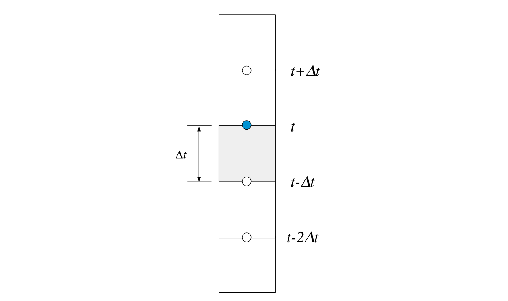
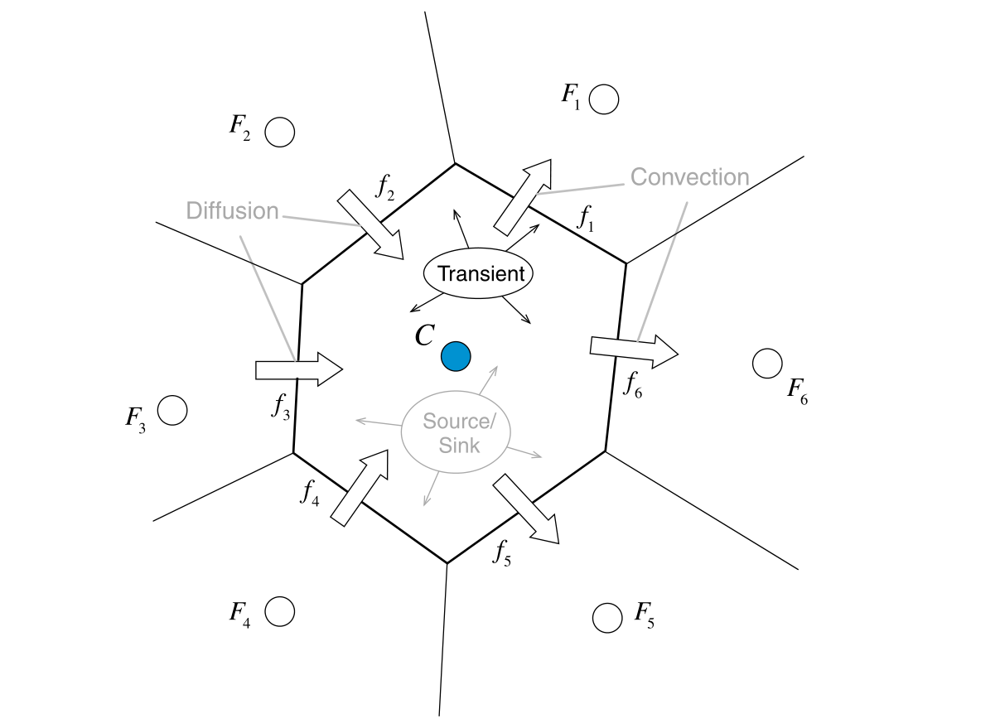

#! https://zhuanlan.zhihu.com/p/604765399
# 有限体积法（六）非稳态项的离散化

本文包括F. Moukalled 写的The Finite Volume Method in Computational Fluid Dynamics- An Advanced Introduction with OpenFOAM and Matlab 这本书的Chapter 13 的部分内容。

---

包含非稳态项的控制方程可以写成如下形式
$$
\frac{\partial(\rho \phi)}{\partial t}+\mathcal{L}(\phi)=0 \tag{6-1}
$$

其中$\mathcal{L}(\phi)$是**空间算子**，包含了非稳态项之外的所有项；而$\partial(\rho \phi)/ \partial t$是非稳态项。将该式应用到控制体$C$上，并转化成半离散格式，有
$$
\frac{\partial\left(\rho_{C} \phi_{C}\right)}{\partial t} V_{C}+L\left(\phi_{C}^{t}\right)=0 \tag{6-2}
$$
其中$L\left(\phi_{C}^{t}\right)$是$t$时刻的空间离散算子。这里先假设$L\left(\phi_{C}^{t}\right)$已经完成了离散化，即
$$
L\left(\phi_{C}^{t}\right)=a_{C} \phi_{C}^{t}+\sum_{F \sim NB(C)} a_{F} \phi_{F}^{t}-b_{C} \tag{6-3}
$$
其中$a_{C},a_{F},b_{C}$都是可计算的系数。

接下来的问题是如何离散$\partial\left(\rho_{C} \phi_{C}\right)/ \partial t$？

## 有限差分法

时间是一维的，自然的，时间上的网格是结构的。因此有限差分方法也适用。有限差分方法的基础内容可以看[计算流体力学（二）有限差分](https://zhuanlan.zhihu.com/p/599416488)和[计算流体力学（三）差分方程](https://zhuanlan.zhihu.com/p/599619784)。这里给出了进一步的拓展。

为了简化标记，在本文中，引用前一个时间步获得的值的变量将用上标$^{\circ}$表示，引用前两个时间步获得的值的变量将用上标$^{\circ\circ}$表示。另一方面，不使用上标表示当前时间步长的变量，但当前时间步长的非稳态项系数用上标$^{\bullet}$表示。

<!--  -->

### 前向欧拉格式

很简单，就是应用这样一个式子
$$
\frac{\partial T(t)}{\partial t}=\frac{T(t+\Delta t)-T(t)}{\Delta t}+O(\Delta t) \tag{6-4}
$$

代入式（6-2），有
$$
a_{C}^{\bullet} \phi_{C}+a_{C}^{\circ} \phi_{C}^{\circ}=b_{C}-\left(a_{C} \phi_{C}^{\circ}+\sum_{F \sim NB(C)} a_{F} \phi_{F}^{\circ}\right) \tag{6-5}
$$
其中
$$
\begin{array}{l}
a_{C}^{\bullet}=\frac{\rho_{C} V_{C}}{\Delta t} \\
a_{C}^{\circ}=-\frac{\rho_{C}^{\circ} V_{C}}{\Delta t}
\end{array} \tag{6-6}
$$

分离变量，有
$$
\phi_{C}=\frac{b_{C}-\left(\left(a_{C}+a_{C}^{\circ}\right) \phi_{C}^{\circ}+\sum\limits_{F \sim NB(C)} a_{F} \phi_{F}^{\circ}\right)}{a_{C}^{\bullet}} \tag{6-7}
$$

显然，这是一个**显式格式**。

### 后向欧拉格式

也很简单，就是应用这样一个式子
$$
\frac{\partial T(t)}{\partial t}=\frac{T(t)-T(t-\Delta t)}{\Delta t}+O(\Delta t) \tag{6-8}
$$

代入式（6-2），有
$$
\left(a_{C}^{\bullet}+a_{C}\right) \phi_{C}+\sum_{F \sim NB(C)} a_{F} \phi_{F}=b_{C}+a_{C}^{\circ} \phi_{C}^{\circ} \tag{6-9}
$$
其中
$$
\begin{array}{l}
a_{C}^{\bullet}=\frac{\rho_{C} V_{C}}{\Delta t} \\
a_{C}^{\circ}=-\frac{\rho_{C}^{\circ} V_{C}}{\Delta t}
\end{array} \tag{6-10}
$$

这是一个**隐式格式**。

###  Crank-Nicolson格式

Crank-Nicolson格式也称CN格式。应用这样一个式子
$$
\frac{\partial T(t)}{\partial t}=\frac{T(t+\Delta t)-T(t-\Delta t)}{2 \Delta t}+O\left(\Delta t^{2}\right) \tag{6-11}
$$
可以看出，精度为二阶。

代入式（6-2），有
$$
a_{C}^{\bullet} \phi_{C}=b_{C}-\left(a_{C} \phi_{C}^{\circ}+\sum_{F \sim NB(C)} a_{F} \phi_{F}^{\circ}\right)-a_{C}^{\circ \circ} \phi_{C}^{\circ \circ} \tag{6-12}
$$
其中
$$
\begin{array}{l}
a_{C}^{\bullet}=\frac{\rho_{C} V_{C}}{2\Delta t} \\
a_{C}^{\circ \circ}=-\frac{\rho_{C}^{\circ \circ} V_{C}}{2 \Delta t}
\end{array} \tag{6-13}
$$
这是一个**显式格式**。

### Adams-Moulton格式
应用这样一个式子
$$
\frac{\partial T(t)}{\partial t}=\frac{3 T(t)-4 T(t-\Delta t)+T(t-2 \Delta t)}{2 \Delta t}+O\left(\Delta t^{2}\right) \tag{6-14}
$$

代入式（6-2），有
$$
\left(a_{C}^{\bullet}+a_{C}\right) \phi_{C}+\sum_{F \sim NB(C)} a_{F} \phi_{F}=b_{C}-a_{C}^{\circ} \phi_{C}^{\circ}-a_{C}^{\circ \circ} \phi_{C}^{\circ \circ} \tag{6-15}
$$

其中
$$
\begin{array}{l}
a_{C}^{\bullet} =\frac{3 \rho_{C} V_{C}}{2 \Delta t} \\
a_{C}^{\circ} =-\frac{2 \rho_{C}^{\circ} V_{C}}{\Delta t} \\
a_{C}^{\circ \circ} =\frac{\rho_{C}^{\circ \circ} V_{C}}{2 \Delta t}
\end{array} \tag{6-16}
$$

这是一个**隐式格式**。

### 稳定性分析

通过[计算流体力学（三）差分方程](https://zhuanlan.zhihu.com/p/599619784)这篇文章的学习，我们应该能认识到**收敛性**和**稳定性**的概念，并用傅里叶变换法来分析稳定性。然而对非结构网格来说，傅里叶变换法并不一定好用。

**CFL条件**也可以用来判断稳定性。简单来说，满足稳定性时，一般有
$$
a_{C}+a_{C}^{\circ} \leq 0 \tag{6-17}
$$

至于为什么这样，我也不知道。估计是为了避免正反馈。

CFL条件法的结果与傅里叶变换法一样：对于显式格式，$\Delta t$有一个上限，超过这个上限，稳定性就不能保证；对于隐式格式，稳定性总能满足。

## 有限体积法

时间的流动与流体的流动很像，因此完全可以把[一维对流项的离散化](https://zhuanlan.zhihu.com/p/604518323)套用到非稳态项的离散化，这里就不赘述了。

## 非均匀时间步长

就有限差分法而言，对于一阶精度的离散格式，非均匀时间步长一般没什么影响，因为其只用了前一步。对于二阶及以上精度的离散格式，非均匀时间步长情况下要调整公式。

而对有限体积法来说，非均匀时间步长没有任何影响。因为有限体积法本身支持非均匀网格。

### Adams-Moulton格式

$$
\left(a_{C}^{\bullet}+a_{C}\right) \phi_{C}+\sum_{F \sim N B(C)} a_{F} \phi_{F}=b_{C}-a_{C}^{\circ} \phi_{C}^{\circ}-a_{C}^{\circ \circ} \phi_{C}^{\circ \circ} \tag{6-18}
$$

其中
$$
\begin{array}{l}
a_{C}^{\bullet} =\left(\frac{1}{\Delta t}+\frac{1}{\Delta t+\Delta t^{\circ}}\right) \rho_{C} V_{C} \\
a_{C}^{\circ} =-\left(\frac{1}{\Delta t}+\frac{1}{\Delta t^{\circ}}\right) \rho_{C}^{\circ} V_{C} \\
a_{C}^{\circ \circ} =\frac{\Delta t}{\Delta t^{\circ}\left(\Delta t+\Delta t^{\circ}\right)} \rho_{C}^{\circ \circ} V_{C}
\end{array} \tag{6-19}
$$

---

## 参考资料

1. F. Moukalled, The Finite Volume Method in Computational Fluid Dynamics- An Advanced Introduction with OpenFOAM and Matlab
2. 有限体积法：一图入门, https://zhuanlan.zhihu.com/p/378570075
3. 时间离散：瞬态项, https://zhuanlan.zhihu.com/p/588627327

[目录](https://zhuanlan.zhihu.com/p/599909213)