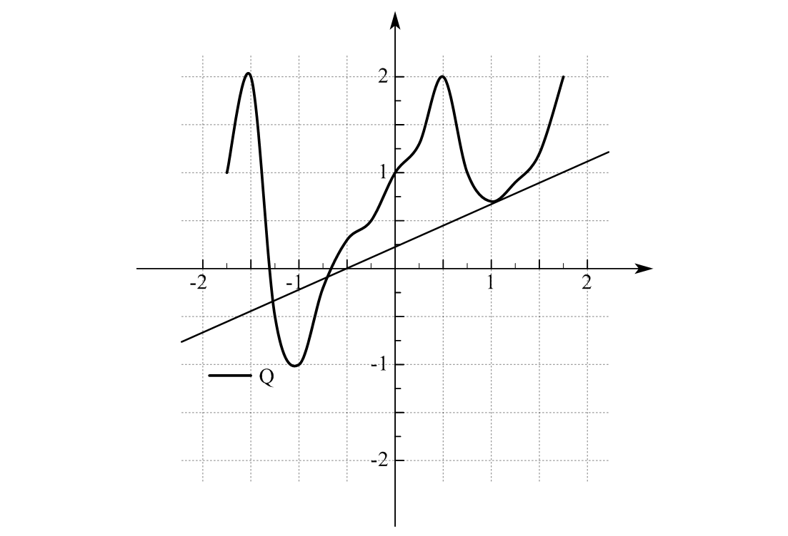

#! https://zhuanlan.zhihu.com/p/604961066
# 有限体积法（七）源项的离散化

本文包括F. Moukalled 写的The Finite Volume Method in Computational Fluid Dynamics- An Advanced Introduction with OpenFOAM and Matlab 这本书的Chapter 14.1 的内容。

---

源项的半离散形式为
$$
Q_{C}^{\phi} V_{C} \tag{7-1}
$$
$V_{C}$由网格信息给出，故只要计算$Q_{C}^{\phi}$。

一般而言，源项可以写成$\phi_{C}$的函数，即
$$
Q_{C}^{\phi}=Q(\phi_{C}) \tag{7-2}
$$

为了将其离散化，用线性关系代替这个函数。为了尽可能提高精度，把基点选为上一时间步的点。有
$$
Q\left(\phi_{C}\right)=Q\left(\phi_{C}^{*}\right)+\left(\frac{\partial Q}{\partial \phi_{C}}\right)^{*}\left(\phi_{C}-\phi_{C}^{*}\right) \tag{7-3}
$$
其中上标$^{*}$表示是上一时间步的值。

---

## 参考资料

1. F. Moukalled, The Finite Volume Method in Computational Fluid Dynamics- An Advanced Introduction with OpenFOAM and Matlab
2. 有限体积法：一图入门, https://zhuanlan.zhihu.com/p/378570075

[目录](https://zhuanlan.zhihu.com/p/599909213)