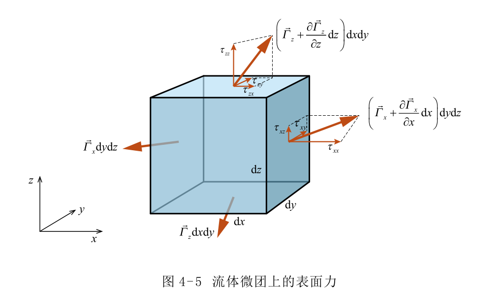

#! https://zhuanlan.zhihu.com/p/603122909
# 流体力学（四）流体动力学基本方程

## 连续方程

积分形式（$\mathrm{cv}$控制体，$\mathrm{cs}$控制体表面）
$$
\frac{\partial}{\partial t} \iiint_{\mathrm{cv}} \rho \mathrm{d} B+\iint_{\mathrm{cs}} \rho(\vec{V} \cdot \vec{n}) \mathrm{d} A=0
$$

微分形式
$$
\frac{\partial\rho}{\partial t}+\nabla\cdot(\rho\vec{V})=0
$$

第一项是控制体内（空间某点）质量的增加量，第二项是流出控制体（空间某点）的质量。

## 动量方程

控制体所受的力就是体积力和表面力之和。对表面力按照一般约定取拉力为正，压力为负。

积分形式
$$
\sum \vec{F}_{\mathrm{cv}}=\frac{\partial}{\partial t} \iiint_{\mathrm{cv}} \vec{V} \rho \mathrm{d} B+\iint_{\mathrm{cs}} \vec{V} \rho(\vec{V} \cdot \vec{n}) \mathrm{d} A
$$

微分形式
$$
\frac{\mathrm{D} \vec{V}}{\mathrm{D} t}=\vec{f}_{\mathrm{b}}+\frac{1}{\rho}\left(\frac{\partial \vec{\Gamma}_{x}}{\partial x}+\frac{\partial \vec{\Gamma}_{y}}{\partial y}+\frac{\partial \vec{\Gamma}_{z}}{\partial z}\right)
$$

注意表面力的分解
$$
\begin{array}{l}
\vec{\Gamma}_{x}=\tau_{x x} \vec{i}+\tau_{x y} \vec{j}+\tau_{x z} \vec{k} \\
\vec{\Gamma}_{y}=\tau_{y x} \vec{i}+\tau_{y y} \vec{j}+\tau_{y z} \vec{k} \\
\vec{\Gamma}_{z}=\tau_{z x} \vec{i}+\tau_{z y} \vec{j}+\tau_{z z} \vec{k}
\end{array}
$$

也就是说
$$
\begin{aligned}
\frac{\mathrm{D} \vec{V}}{\mathrm{D} t}=\vec{f}_{\mathrm{b}} & +\frac{1}{\rho}\left(\frac{\partial \tau_{x x}}{\partial x}+\frac{\partial \tau_{y x}}{\partial y}+\frac{\partial \tau_{z x}}{\partial z}\right) \vec{i} \\
& +\frac{1}{\rho}\left(\frac{\partial \tau_{x y}}{\partial x}+\frac{\partial \tau_{y y}}{\partial y}+\frac{\partial \tau_{z y}}{\partial z}\right) \vec{j} \\
& +\frac{1}{\rho}\left(\frac{\partial \tau_{x z}}{\partial x}+\frac{\partial \tau_{y z}}{\partial y}+\frac{\partial \tau_{z z}}{\partial z}\right) \vec{k}
\end{aligned}
$$
且有
$$
\tau_{x y}=\tau_{y x}, \quad \tau_{y z}=\tau_{z y}, \quad \tau_{z x}=\tau_{x z}
$$

事实上该公式对固体也同样适用。

### 欧拉方程

流体的粘性力相比压力是非常小的，所以应该可以忽略切应力，并让正应力等于压力
$$
\begin{array}{l}
\tau_{x y}=\tau_{y x}=0, \tau_{y z}=\tau_{z y}=0, \tau_{z x}=\tau_{x z}=0 \\
\tau_{x x}=\tau_{y y}=\tau_{z z}=-p
\end{array}
$$

则有**欧拉方程**
$$
\frac{\mathrm{D} \vec{V}}{\mathrm{D} t}=\vec{f}_{\mathrm{b}}-\frac{1}{\rho} \nabla p
$$

### 广义牛顿内摩擦定律

如果粘性应力与应变率成正比，那么这种流体就是**牛顿流体**。牛顿流体在任意流动状态下的应力与应变率的关系，是牛顿流体的本构方程

$$
\begin{array}{l}
\tau_{y x}=\tau_{x y}=\mu\left(\frac{\partial u}{\partial y}+\frac{\partial v}{\partial x}\right) \\
\tau_{z y}=\tau_{y z}=\mu\left(\frac{\partial v}{\partial z}+\frac{\partial w}{\partial y}\right) \\
\tau_{x z}=\tau_{z x}=\mu\left(\frac{\partial w}{\partial x}+\frac{\partial u}{\partial z}\right) \\
\tau_{x x}=2 \mu \frac{\partial u}{\partial x}-\frac{2}{3} \mu(\nabla \cdot \vec{V})-p \\
\tau_{y y}=2 \mu \frac{\partial v}{\partial y}-\frac{2}{3} \mu(\nabla \cdot \vec{V})-p \\
\tau_{z z}=2 \mu \frac{\partial w}{\partial z}-\frac{2}{3} \mu(\nabla \cdot \vec{V})-p
\end{array}
$$

### N-S方程

将牛顿流体的本构方程代入应力形式的动量方程中，就可以得到最终形式的动量方程，即N-S方程
$$
\frac{\mathrm{D} \vec{V}}{\mathrm{D} t}=\vec{f}_{\mathrm{b}}-\frac{1}{\rho} \nabla p+\frac{\mu}{\rho} \nabla^{2} \vec{V}+\frac{1}{3} \frac{\mu}{\rho} \nabla(\nabla \cdot \vec{V})
$$

$\frac{\mathrm{D} \vec{V}}{\mathrm{D} t}$流体的动量随时间的变化, 或称之为惯性力项。
$\vec{f}_{\mathrm{b}}$体积力项。
$-\frac{1}{\rho} \nabla p$压差力项。
$\frac{\mu}{\rho} \nabla^{2} \bar{V}+\frac{1}{3} \frac{\mu}{\rho} \nabla(\nabla \cdot \bar{V})$粘性力项。

只要流体不是处于强压缩（如强激波内部）流动，N-S方程可写成
$$
\frac{\mathrm{D} \vec{V}}{\mathrm{D} t}=\vec{f}_{\mathrm{b}}-\frac{1}{\rho} \nabla p+\frac{\mu}{\rho} \nabla^{2} \vec{V}
$$
