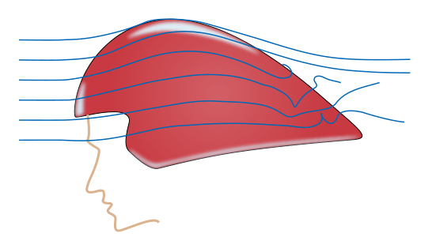
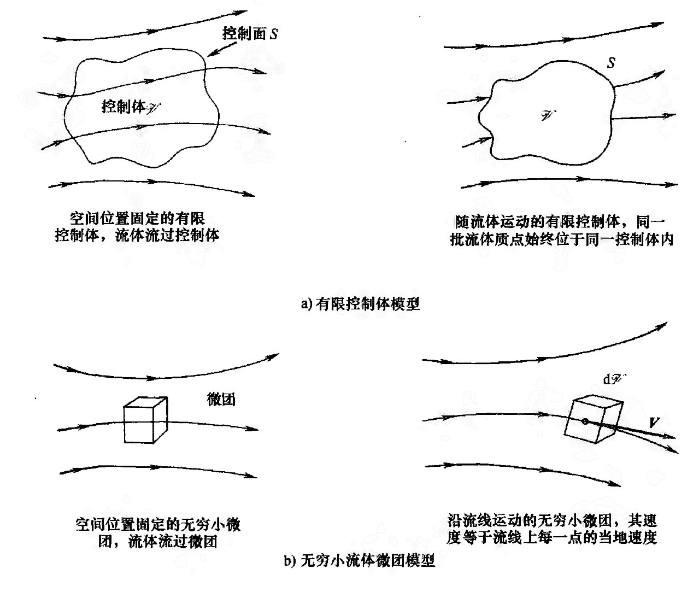
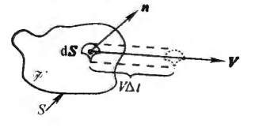
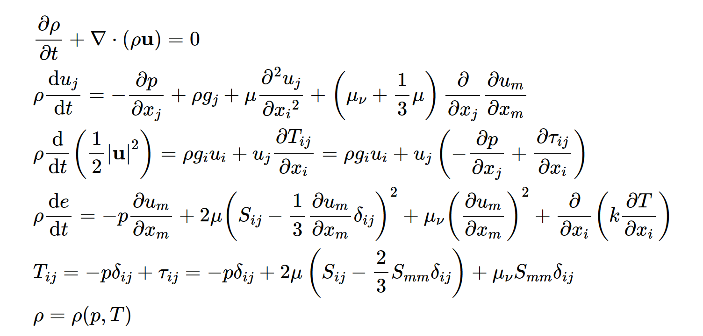

#! https://zhuanlan.zhihu.com/p/599269604
# 计算流体力学（一）流体力学控制方程组

**流体力学控制方程组**是流体运动物理学原理的数学描述，计算流体力学的核心就是采用计算机解这个控制方程组。

## 如何描述流体？

用描述刚体运动的方法来描述流体，显然非常困难。因此应采用其它概念来描述流体。

用欧拉法可以把流体运动表示为一个矢量场，这就允许我们用微积分的方法处理。流体还有密度、温度、浓度等属性，这要用标量场表示。此外可以把流体看成一团一团的流体的组合或一个个点的组合，这就涉及到流动模型。最后，因为流体是流动的，分析流体对象时必须要把流动考虑在内。

### 流体运动
想象一下，在流体流过的空间，每一点上的流体微元有不同的速度。因此，可以这样描述流体运动：“在$t$时刻，$(x,y,z)$点处流体质点的速度为$\bm{V}$”。这就是**欧拉法**。

自然的，可以采更数学的描述，即用一个矢量函数$\bm{V}(x,y,z,t)$来描述流体。当$t$固定时，就可以得到一个矢量场$\bm{V}(x,y,z)$，这就是**流场**。自然的，跟电场线一样，可以用**流线**把这个矢量场画出来。

### 质量分布
质量分布用**标量密度场**表示，表示为
$$\rho = \rho(x,y,z,t)$$

### 流动模型

想要把物理规律作用到流体上，必须得找到物理规律的作用对象。下图就展示了如何确定作用对象。

#### 有限控制体

可以在流场中用封闭曲面围成一个有限体积的封闭体，称为**控制体**$\mathscr{V}$，闭曲面称为**控制面**$S$。

控制体的位置可以是固定的，此时会有流体流过控制体。控制体也可以随流体运动，使得位于这个控制体内的流体质点始终是同一批。无论哪一种情形，控制体都是流动中大小适当的有限区域。**物理学的基本原理将被运用到控制体内的流体上。**

对于空间位置固定的有限控制体，应用物理规律得到的方程组，称为**守恒型控制方程**。而对于随流体运动的有限控制体，得到的方程组，称为**非守恒型控制方程**。注意之所以要分为守恒型控制方程和非守恒型控制方程，是因为**方程形式会对计算机求解造成影响**。

#### 无穷小流体微团

**无穷小流体微团**可以理解成无限小的控制体，其体积微元是$\text{d}\mathscr{V}$。流体微团无限小的含义与微积分中无限小的含义相同，但是它又必须足够大，大到包含了大量的流体分子，使它能够被看成是连续介质。

流体微团的位置也可以是固定的,此时会有流体流过微团。流体微团还可以沿流线运动，其速度$\bm{V}$等于流线上每一点的流速。和前面一样，**物理学基本原理仅仅运用于流体微团本身**。

对于空间位置固定的流体微团，应用物理原理得到的方程组仍旧称为守恒型方程。而对于运动的流体微团，得到的方程组也还是称为非守恒型方程。

### 物质导数

一个流体微团沿流线运动，该流体微团的密度为$\rho_a(t)$。标量密度场为$\rho(x,y,z,t)$。

在$t$时刻，流体微团的坐标为$(x,y,z)$，则有
$$\frac{\text{d}\rho_a}{\text{d}t}=\frac{\partial\rho}{\partial t}+\bm{V}\cdot\nabla\rho$$
可定义
$$
\boxed{
    \frac{\text{D}}{\text{D}t}
    \equiv
    \frac{\partial}{\partial t}
    +
    (\bm{V}\cdot\nabla)
    }
$$

$\text{D}/\text{D}t$称为**物质导数**，它在物理上是跟踪一个运动的流体微团的时间变化率；$\partial/\partial t$叫作**当地导数**，它在物理上是固定点处的时间变化率；$\bm{V}\cdot\nabla$叫作**迁移导数**，它在物理上表示由于流体微团从流场中的一点运动到另一点，流场的空间不均匀性而引起的时间变化率。

物质导数可用于任何流场变量，比如$\text{D}T/\text{D}t$，从物理上描述了流体微团经过流场中某一点时，微团温度的变化。一部分是由于该点处流场温度本身随时间的涨落（当地导数），另一部分则是由于流体微团正在流向流场中温度不同的另一点（迁移导数）。

### 速度散度

流体各点速度为$\bm{V}(x,y,z,t)$。则$\nabla\cdot\bm{V}$称为**速度散度**。

如图，考虑随流体运动的控制体，其体积为$\mathscr{V}$。则有
$$\frac{\text{D}\mathscr{V}}{\text{D}t}=\iint_{S}\bm{V}\cdot\text{d}\bm{S}=\iiint_{\mathscr{V}}(\nabla\cdot\bm{V})\text{d}\mathscr{V}$$
其中第二个等号用了散度定理。将控制体体积缩小至$\delta\mathscr{V}$，即变为运动流体微团，则有
$$\iiint_{\delta\mathscr{V}}(\nabla\cdot\bm{V})\text{d}\mathscr{V}=(\nabla\cdot\bm{V})\delta\mathscr{V}$$
可推出
$$
\boxed{
    \nabla\cdot\bm{V}
    =
    \frac{1}{\delta\mathscr{V}}
    \frac{\text{D}(\delta\mathscr{V})}{\text{D}t}
    }
$$
这说明速度散度的物理意义就是，每单位体积运动着的流体微团，体积相对变化的时间变化率。

<!-- ## 流体运动的物理学原理

### 连续性方程

物理原理是**质量守恒**。

守恒型微分形式
$$
\frac{\partial\rho}{\partial t}
+
\nabla\cdot(\rho\bm{V})
=0
$$

非守恒型微分形式
$$
\frac{\text{D}\rho}{\text{D} t}
+
\rho\nabla\cdot\bm{V}
=0
$$

可以证明，这两个方程是等价的。

### 动量方程

物理原理是**牛顿第二定律**。

### 能量方程

物理原理是**能量守恒**。

动量方程和能量方程比较复杂，这里就不给出了。 -->

## 流体力学方程组

这里讨论的流体是**牛顿流体**：流体的应力和流体的速度梯度有线性关系，也就是服从广义胡克定律的关系。那么，结合之前描述流体的方法，可以用流体力学方程组描述流体的行为。注意这里给出的方程中非守恒型方程和守恒型方程混用。对于非守恒型方程，只要应用物质导数有关公式就可以转化为守恒型方程，实际上这两种方程是等价的。

描述流体微元的物理量有$\rho,p,T,e,\bm{u}$，一共7个分量。其中$\rho$为密度，$p$为压强， $T$为温度，$e$为单位质量的内能，$\bm{u}$为速度。

流体力学方程组，分别是质量守恒方程(1)、动量守恒方程(2)、动能守恒方程(3)、内能守恒方程(4)、本构方程(5)和两个状态方程(6)(7)，一共7组方程。

<!--  -->

$$
\frac{\partial\rho}{\partial t}+\nabla\cdot(\rho\bm u)=0\tag{1}
$$

$$
\rho \frac{\text{D}u_j}{\text{D}t}=-\frac{\partial p}{\partial x_j}+\rho g_j+\mu\frac{\partial^2 u_j}{\partial x_i^2} +(\mu_\nu+\frac{1}{3}\mu)\frac{\partial}{\partial x_j}\frac{\partial u_m}{\partial x_m}\tag{2}
$$

$$
\rho \frac{\text{D}}{\text{D}t}(\frac{1}{2}|\bm u|^2)=\rho g_iu_i+u_j\frac{\partial T_{ij}}{\partial x_i}=\rho g_iu_i+u_j(-\frac{\partial p}{\partial x_j}+\frac{\partial \tau_{ij}}{\partial x_i})\tag{3}
$$

$$
\rho \frac{\text{D}e}{\text{D}t}=-p\frac{\partial u_m}{\partial x_m}+2\mu(S_{ij}-\frac{1}{3}\frac{\partial u_m}{\partial x_m}\delta_{ij})^2+\mu_\nu(\frac{\partial u_m}{\partial x_m})^2+\frac{\partial }{\partial x_i}(k\frac{\partial T}{\partial x_i})\tag{4}
$$

$$
T_{ij}=-p\delta_{ij}+\tau_{ij}=-p\delta_{ij}+2\mu (S_{ij}-\frac{2}{3}S_{mm}\delta_{ij})+\mu_\nu S_{mm} \delta_{ij}\tag{5}
$$

$$
\rho=\rho(p,T)\tag{6}
$$

$$
e=e(p,T)\tag{7}
$$

流体力学方程组的参数有$\bm{g},\mu,\mu_\nu$。其中$\bm{g}$一般情况下可以看做重力加速度(？这个我也不是很清楚，资料上说“$\bm{g}$表示作用于每个流体微元上的体力，例如重力就是体力的一种”，那么是否有其它力我不是很明白？)；$\mu$和$\mu_\nu$分别为**第一粘性系数**和**第二粘性系数**，由流体自身性质决定。状态方程也由流体自身性质决定。

流体力学方程组的动量守恒方程是三分量的。而动能守恒方程可以由动量守恒方程推出，所以可以舍去。本构方程和状态方程可以代入质量守恒方程、动量守恒方程和内能守恒方程，故独立的变量只有$p,T,\bm{u}$。5个独立的方程和5个独立的变量，构成了完备的流体力学方程组。

## 物理边界条件

当流体与固体交互时，光靠流体力学方程组是不够的，还要给出边界条件。

紧挨物面的流体与物面之间的相对速度为零，称为**无滑移条件**。即
$$\bm u=0\quad(在物面)$$

此外，就温度而言，还有两种情况。一种是物面温度给定$T_w$，则有
$$T=T_w\quad(在物面)$$
另一种是物面绝热，有
$$(\frac{\partial T}{\partial \bm{n}})_w=0\quad(在物面)$$
当然存在流体与物面发生热交换的情况，但这种情况过于复杂。

<未完继续>

## 参考资料
1. 美.约翰D.安德森 计算流体力学基础及其应用 2007
2. 王洪伟 我所理解的流体力学 2014
3. 小时物理百科 https://wuli.wiki/online/index.html