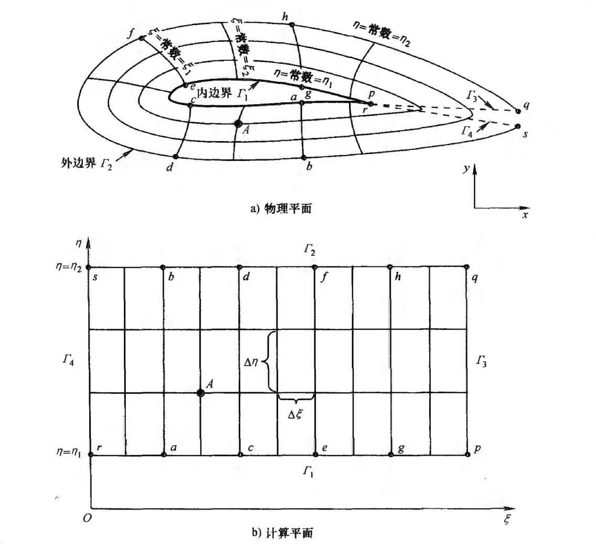

#! https://zhuanlan.zhihu.com/p/602359980
# 计算流体力学（七）有限体积法

[之前的文章](https://zhuanlan.zhihu.com/p/600219849)介绍了有限差分法为了应对复杂的边界，建立了物理平面与计算平面。但是，一方面，计算平面的是矩形网格状的，这对物理平面上网格的划分带来了较大的限制；另一方面，坐标变换会引入额外的误差。而**有限体积法**能够解决这些不足。

## 控制体

想象一下为了建立派蒙飞行的空气动力模型，划分了网格，如图所示。显然不存在一个计算平面与该网格对应。

但是，我们依旧可以进行离散化。这一个个网格组成了一个个体积有限的体。二维情况如下图所示。这一个个体称为**控制体**。

记偏微分方程所求的变量为$u$。$u$可以是标量，如压强，也可以是矢量，如速度。每一个控制体都有一个$u_i$，代表该**控制体内该变量分布的平均值**。即
$$
u_i=\frac{1}{\Omega_i}\iint\limits_{\Omega_i}^{} u \text{d}S
$$

利用$u_i$可以求控制体边界上的$u$。最常见的就是**中心型有限体积法**
$$
u_{i+\frac{1}{2}}=\frac{1}{2}(u_i+u_{i+1})
$$
该方法有**二阶精度**。与有限差分的差分格式一样，还存在其它利用$u_i$求控制体边界上的$u$的方法。

<未完继续>

--------------------------------------------------

有限体积法的内容有点多，所以开了新坑，请跳到[有限体积法（一）离散过程](https://zhuanlan.zhihu.com/p/603476900)

## 参考文献
1. https://www.bilibili.com/video/BV1jE411E73A?p=15

[目录](https://zhuanlan.zhihu.com/p/599909213)