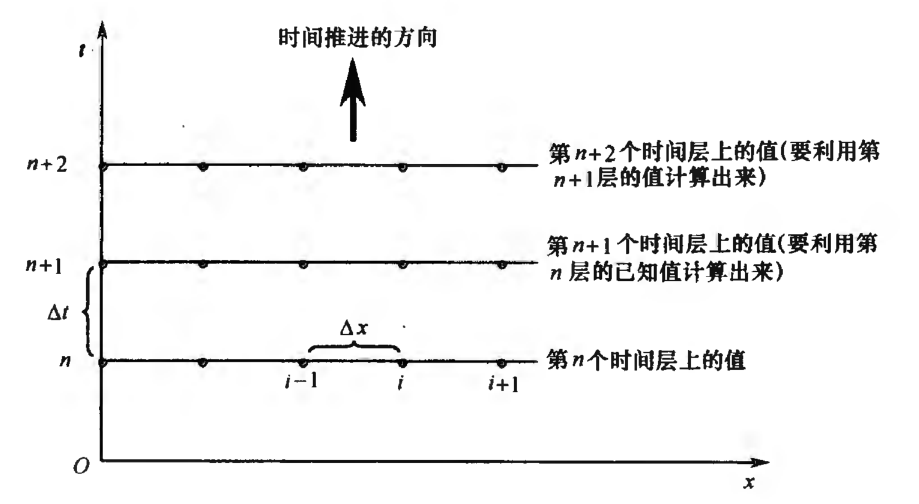
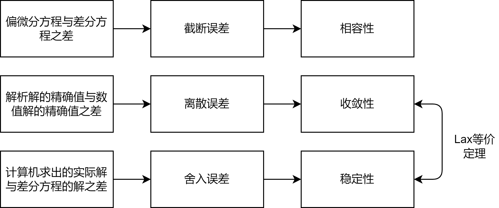

#! https://zhuanlan.zhihu.com/p/599619784
# 计算流体力学（三）差分方程

[上一篇文章](https://zhuanlan.zhihu.com/p/599416488)给出了离散化和有限差分的概念，并将有限差分作用于弦振动方程，得到一个差分方程，最后利用Python程序计算了这个差分方程，给出了弦振动问题的数值解。这篇文章将深入探讨差分方程。

考虑一维热传导方程
$$
\frac{\partial T}{\partial t}-\alpha \frac{\partial^2 T}{\partial x^2}=0\tag{3-1}
$$
$T$为温度，$t,x$分别为时间与一维坐标。该方程反映一维情况下温度分布随时间的变化。其解为$T(t,x)$，离散化后产生网格点$(t_n,x_i)$，解变为$T_{n,i}$，或者换种写法$T^n_{i}$。有限差分作用于偏微分方程后，得到差分方程
$$
\frac{T_{i}^{n+1}-T_{i}^{n}}{\Delta t}=\alpha \frac{T_{i+1}^{n}-2 T_{i}^{n}+T_{i-1}^{n}}{(\Delta x)^{2}}\tag{3-2}
$$
且该差分方程截断误差为$\text{O}\left[\Delta t,(\Delta x)^{2}\right]$。回顾一下，有限差分求解的含义是指用差分方程表示偏微分方程，然后求解差分方程，得到解在每个离散网格点上的数值，而这些网格点都分布在所求解的物理区域内。而**截断误差正是差分方程和偏微分方程的区别**。

<!-- 当网格点的数量趋于无限多，即$\Delta x\to 0,\Delta t\to 0$时，截断误差趋于零，差分方程趋于原偏微分方程，可以说偏微分方程的这个有限差分表示是**相容的**。**假如差分方程是相容的，假如求解差分方程的数值方法是稳定的，再假如边界条件已经用合理的数值方法进行了处理，那么差分方程的数值解就应该能够代表微分方程的解析解，至少是在截断误差的范围之内是这样。** -->

## 显式方法和隐式方法

### 显式方法

继续研究公式(3-2)，就像上一篇文章那样，将其转换为
$$
T_{i}^{n+1}=T_{i}^{n}+\alpha \frac{\Delta t}{(\Delta x)^{2}}\left(T_{i+1}^{n}-2 T_{i}^{n}+T_{i-1}^{n}\right)\tag{3-3}
$$
于是可以根据$T_{i}^{n}$求出$T_{i}^{n+1}$，进而求解差分方程。这就是**显式方法**。

可以这样定义：显式方法中每一个差分方程只包含一个未知数，从而这个未知数可以用直接计算的方式显式地求解。显式方法是最简单的方法。

### 隐式方法

这里引入一个新的差分公式，其被称为克兰克-尼科尔森格式
$$
\left(\frac{\partial^2 T}{\partial x^2}\right)_{n,i}=\frac{\frac{T_{i+1}^{n+1}+T_{i+1}^{n}}{2}-2\left(\frac{T_{i}^{n+1}+T_{i}^{n}}{2}\right)+\frac{T_{i-1}^{n+1}+T_{i-1}^{n}}{2}}{(\Delta x)^{2}}\tag{3-4}
$$

代入公式(3-1)，则有
$$
\frac{T_{i}^{n+1}-T_{i}^{n}}{\Delta t}=\alpha \frac{\frac{T_{i+1}^{n+1}+T_{i+1}^{n}}{2}-2\left(\frac{T_{i}^{n+1}+T_{i}^{n}}{2}\right)+\frac{T_{i-1}^{n+1}+T_{i-1}^{n}}{2}}{(\Delta x)^{2}}\tag{3-5}
$$

如果想用第$n$个时间层上的值计算出第$n+1$个时间层上的值，那么已知量有$T_{i-1}^{n},T_{i}^{n},T_{i+1}^{n}$，未知量有$T_{i-1}^{n+1},T_{i}^{n+1},T_{i+1}^{n+1}$。这意味着需要联立方程组才能求出第$n+1$个时间层上的值。对于排列在同一时间层所有网格点上的未知量，必须将它们联立起来同时求解，才能求出这些未知量，这种方法就定义为**隐式方法**。

显式方法和隐式方法的优缺点如下。

1.显式方法

优点：方法的建立及编程相对简单。

缺点：取定的$\Delta x,\Delta t$必须小于稳定性条件对它提出的限制。在某些情形，$\Delta t$必须很小，才能保持稳定性，这需要巨大的计算量。

2.隐式方法

优点：用大得多的$\Delta t$值也能保持稳定性。

缺点：方法的建立和编程更复杂。而且，由于每一时间步的计算通常需要大量的矩阵运算，每一时间步的计算机运行的时间要比显式方法长得多。另外，$\Delta t$取大的值，截断误差就大，精度低。

## 误差与稳定性分析

继续考虑热传导方程(3-1)，即
$$
\frac{\partial T}{\partial t}-\alpha \frac{\partial^2 T}{\partial x^2}=0\tag{3-1}
$$
及其差分方程(3-2)，即
$$
\frac{T_{i}^{n+1}-T_{i}^{n}}{\Delta t}=\alpha \frac{T_{i+1}^{n}-2 T_{i}^{n}+T_{i-1}^{n}}{(\Delta x)^{2}}\tag{3-2}
$$

### 相容性

差分方程(3-2)截断误差为$\text{O}\left[\Delta t,(\Delta x)^{2}\right]$。记在点$(t,x)$上截断误差为$R(t,x)$，则有
$$
R(t_n,x_i)=\frac{T(t_{n+1},x_i)-T(t_{n},x_i)}{\Delta t}-\alpha \frac{T(t_{n},x_{i+1})-2T(t_{n},x_i)+T(t_{n},x_{i-1})}{(\Delta x)^{2}}\tag{3-6}
$$
将其展开一下，有
$$
R(t,x)=\frac{1}{2}\frac{\partial^2 T}{\partial t^2}\Delta t-\frac{\alpha}{12}\frac{\partial^4 T}{\partial t^4}(\Delta x)^{2}+\text{O}\left[(\Delta t)^{2},(\Delta x)^{4}\right]\tag{3-7}
$$
于是可以定义偏微分方程与差分方程**相容**，当
$$
\lim_{\Delta t,\Delta x\to 0}R(t,x)=0\tag{3-8}
$$
显然热传导方程与差分方程(3-2)相容。而**相容性条件是求解偏微分方程的必要条件**。

### 收敛性

热传导方程的精确解为$T(t,x)$，而差分方程的精确解为$T_{i}^{n}$。于是可以定义**离散误差**$e_{i}^{n}$，有
$$
e_{i}^{n}:=T_{i}^{n}-T(t_n,x_i)\tag{3-9}
$$
于是可以定义偏微分方程的差分格式**收敛**，当
$$
\lim_{\Delta t,\Delta x\to 0}e_{i}^{n}=0\tag{3-10}
$$
**收敛性条件也是求解偏微分方程的必要条件**。

现在讨论差分格式(3-2)是否收敛。联立公式(3-2)、公式(3-6)和公式(3-9)，可得
$$
e_{i}^{n+1}=(1-2\alpha\lambda)e_{i}^{n}+\alpha\lambda\left(e_{i+1}^{n}+e_{i-1}^{n}\right)-\Delta t T\left(t_{n},x_{i} \right)\tag{3-11}
$$
其中$\lambda:=\frac{\Delta t}{(\Delta x)^2}$。这里不严谨地讨论一下。当$\Delta t,\Delta x\to 0$时，$T\left(t_{n},x_{i} \right)=0$。且$e_{i}^{n}$值应该与$e_i^0$有关，而$n=0$时应该没有离散误差，所以满足收敛性条件。事实上，以上的结论只有在$1-2\alpha\lambda\ge0$的条件下才成立。具体论证过程可以参考偏微分方程数值解法教材。

### 稳定性

差分方程的精确解为$T_{i}^{n}$，但实际计算过程中，由于计算机存储数字的精度有限，会产生**舍入误差**。记在有限精度的计算机上计算出差分方程的解为$N_i^n$，则可定义舍入误差为
$$
\varepsilon_i^n=N_i^n-T_{i}^{n}\tag{3-12}
$$
在计算机计算过程中，显然不能让舍入误差过大，因此可以这样定义**稳定性**
$$
\left|\frac{\varepsilon_{i}^{n+1}}{\varepsilon_{i}^{n}}\right|\leq1\tag{3-13}
$$
**收敛性条件也是求解偏微分方程的必要条件**。

下面研究差分方程(3-2)的稳定性。首先可以认为计算机的解$N_i^n$满足差分方程(3-2)，而$T_{i}^{n}$显然也满足，则由线性关系知
$$
\frac{\varepsilon_{i}^{n+1}-\varepsilon_{i}^{n}}{\Delta t}=\alpha \frac{\varepsilon_{i+1}^{n}-2 \varepsilon_{i}^{n}+\varepsilon_{i-1}^{n}}{(\Delta x)^{2}}\tag{3-14}
$$
即舍入误差$\varepsilon_i^n$也满足差分方程(3-2)，则有
$$
\varepsilon_{i}^{n+1}=(1-2\alpha\lambda)\varepsilon_{i}^{n}+\alpha\lambda\left(\varepsilon_{i+1}^{n}+\varepsilon_{i-1}^{n}\right)\tag{3-15}
$$
其中$\lambda:=\frac{\Delta t}{(\Delta x)^2}$。现在有一个问题，已知稳定性的定义只包含$\varepsilon_{i}^{n},\varepsilon_{i}^{n+1}$，那么如何把$\varepsilon_{i-1}^{n},\varepsilon_{i+1}^{n}$转变为$\varepsilon_{i}^{n}$？

答案是傅里叶变换，因为傅里叶变换的位移定理可以方便地处理这种问题。这里不严谨地利用傅里叶变换。直接把数组$\varepsilon_{i}^{n}$延拓成函数$f_{n}(x)$，则有
$$
f_{n+1}(x)=(1-2\alpha\lambda)f_{n}(x)+\alpha\lambda\left(f_{n}(x+\Delta x)+f_{n}(x-\Delta x)\right)\tag{3-16}
$$
应用傅里叶变换
$$
F_{n+1}(k)=(1-2\alpha\lambda+\alpha\lambda(e^{ik\Delta x}+e^{-ik\Delta x}))F_{n}(k)\tag{3-17}
$$
结合稳定性的定义，则当差分方程稳定时，对$\forall k\in\text{R}$有
$$
\left|1-2\alpha\lambda+\alpha\lambda(e^{ik\Delta x}+e^{-ik\Delta x})\right|\leq1\tag{3-18}
$$
推得
$$
\alpha\lambda\leq\frac{1}{2}\tag{3-19}
$$
这就是差分方程(3-2)的稳定性条件。

### Lax等价定理

给定一个适定的线性初值问题以及与其相容的差分格式，则差分格式的稳定性是差分格式收敛性的充分必要条件。

使用这个定理时必须注意其条件。

(1)考虑的问题是初值问题，并包括周期性边界条件的初边值问题。

(2)初值问题必须是适定的。

(3)初值问题是线性的，关于非线性问题可能无这样简洁的关系。

(4)差分格式是相容的。

## 参考资料
1. 美.约翰D.安德森 计算流体力学基础及其应用 2007
2. 陆金甫 偏微分方程数值解法（第3版）
3. 梁昆淼 数学物理方法（第四版）

[目录](https://zhuanlan.zhihu.com/p/599909213)

下一篇文章 [计算流体力学（四）不可压库艾特流的数值解](https://zhuanlan.zhihu.com/p/600043678)

