#! https://zhuanlan.zhihu.com/p/599416488
# 计算流体力学（二）有限差分

流体力学控制方程都是偏微分方程。如何用计算机解偏微分方程？因为偏微分方程是连续的，而计算机的数据结构无法表示连续的函数及算子（如偏导），所以，必须将偏微分方程**离散化**。最简单的离散化方法就是**有限差分**。

## 函数的离散化

这里以弦振动问题为例。弦是一维的，弦长为$l$，在$t$时刻，$x$处弦微段的位移是$u(t,x)$。在$t=0$时，敲击弦$x=x_0$处，那么弦之后的运动可以用下面的偏微分方程表示。
$$
\left\{\begin{matrix} \begin{aligned}
&\frac{\partial^2 u}{\partial t^2}-a^2\frac{\partial^2 u}{\partial x^2}=0\quad(0<x<l)\\  
&u|_{x=0}=u|_{x=l}=0\\
&u|_{t=0}=0\\
&\frac{\partial u}{\partial t}|_{t=0}=v_0\delta(x-x_0)
\end{aligned}\end{matrix}\right. 
$$
其中$\delta(x-x_0)$为狄拉克函数。本文将尝试用Python解这个偏微分方程。

上面偏微分的解$u(t,x)$在定义域$\{(t,x)|t\geq 0,0<x<l\}$是连续的，每一个点$(t,x)$都有一个值$u(t,x)$。现在，让这些点变成有限个，即用一组网格上的点来代替原来无限的点。在$t$方向，相邻两点之间距离为$\Delta t$，而在$x$方向，相邻两点之间距离为$\Delta x$。这样，就可以用一个数组$u_{n,i}$来代替原来的函数。
$$
u_{n,i}=u(n\Delta t,i\Delta x)\quad(i,j=0,1,2\dots)
$$

更一般的，对二元函数来说，离散化就是指用数组$u_{i,j}$，代替函数$u(x,y)$。而数组正是计算机的数据结构之一。

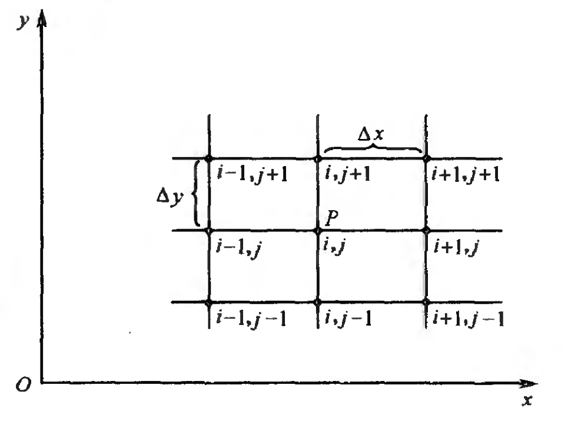

## 有限差分

现在已经能把函数表示为数组了。但是，偏微分方程不只有函数，还有偏微分。如何表示偏微分？

很自然的，结合偏微分的定义，有如下式子
$$
(\frac{\partial u}{\partial x})_{i,j}\approx
\frac{u_{i+1,j}-u_{i,j}}{\Delta x}
$$
其精度是多少？

根据泰勒展开公式
$$
f(x+\Delta x)=f(x)+\frac{\partial f}{\partial x} \Delta x+\frac{\partial^{2} f}{\partial x^{2}} \frac{(\Delta x)^{2}}{2}+\cdots+\frac{\partial^{n} f}{\partial x^{n}} \frac{(\Delta x)^{n}}{n !}+\cdots
$$

同除$\Delta x$后，有
$$
(\frac{\partial u}{\partial x})_{i,j}=
\frac{u_{i+1,j}-u_{i,j}}{\Delta x}-
(\frac{\partial^2 u}{\partial x^2})_{i,j}\frac{\Delta x}{2}-
(\frac{\partial^3 u}{\partial x^3})_{i,j}\frac{(\Delta x)^2}{6}+\cdots
$$

则可写成
$$
\boxed{(\frac{\partial u}{\partial x})_{i,j}=
\frac{u_{i+1,j}-u_{i,j}}{\Delta x}+
\text{O}(\Delta x)}
$$
因此该表达式具有**一阶精度**。该**有限差分表达式**被称为**一阶向前差分**。同样的
$$
\boxed{(\frac{\partial u}{\partial x})_{i,j}=
\frac{u_{i,j}-u_{i-1,j}}{\Delta x}+
\text{O}(\Delta x)}
$$
该有限差分表达式被称为**一阶向后差分**。

结合一阶向前差分和一阶向后差分，可以得到**二阶中心差分**，具有**二阶精度**。
$$
\boxed{(\frac{\partial u}{\partial x})_{i,j}=
\frac{u_{i+1,j}-u_{i-1,j}}{2\Delta x}+
\text{O}(\Delta x)^2}
$$

对于二阶偏导，继续利用泰勒级数可得
$$
\boxed{\left(\frac{\partial^{2} u}{\partial x^{2}}\right)_{i, j}=\frac{u_{i+1, j}-2 u_{i, j}+u_{i-1, j}}{(\Delta x)^{2}}+\text{O}(\Delta x)^{2}}
$$

而对于混合偏导，有
$$
\boxed{\left(\frac{\partial^{2} u}{\partial x \partial y}\right)_{i, j}=\frac{u_{i+1, j+1}-u_{i+1, j-1}-u_{i-1, j+1}+u_{i-1, j-1}}{4 \Delta x \Delta y}+\text{O}\left[(\Delta x)^{2},(\Delta y)^{2}\right]}
$$

总结如下

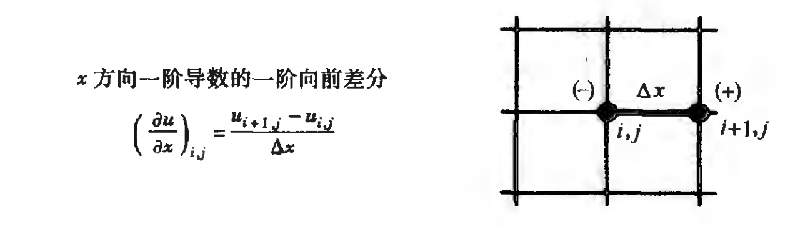
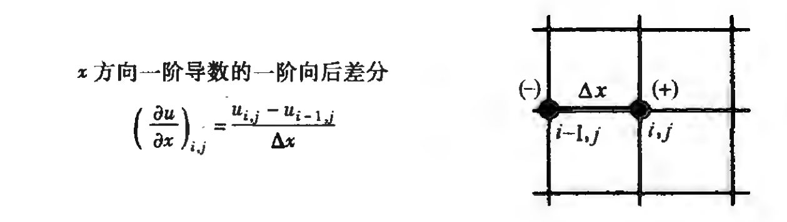
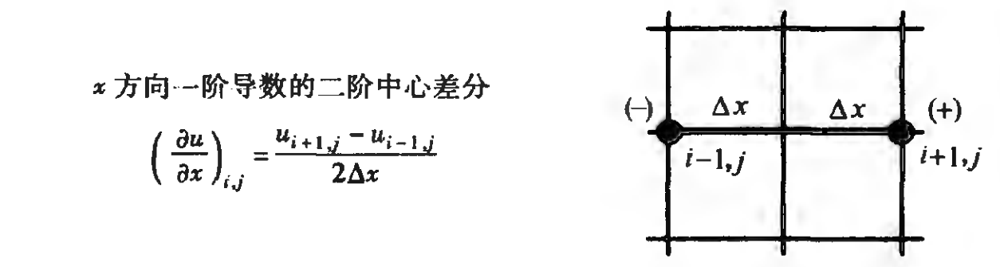
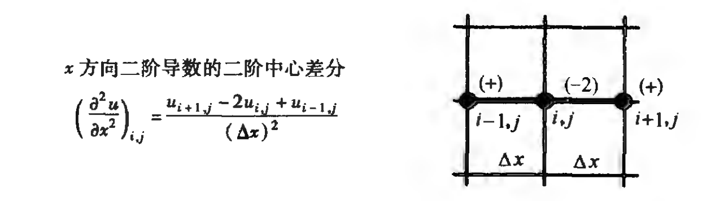
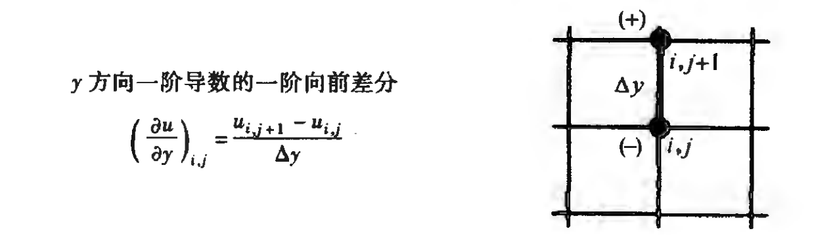
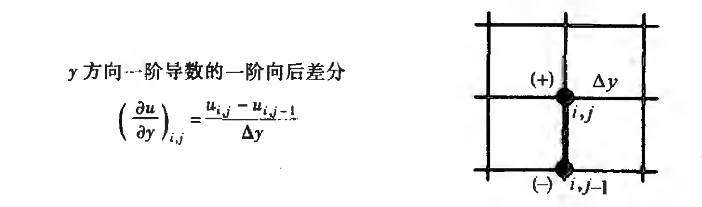
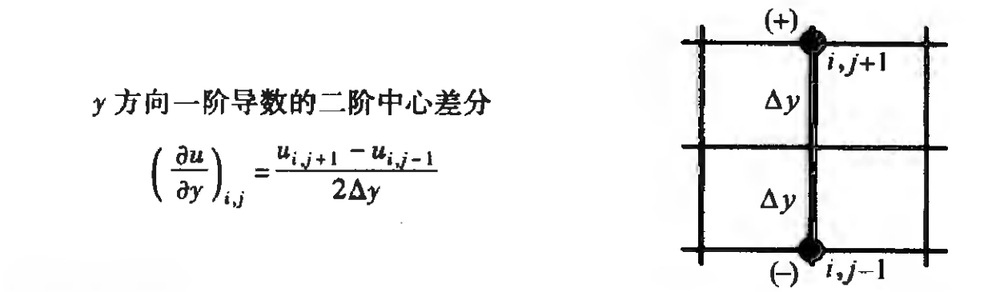
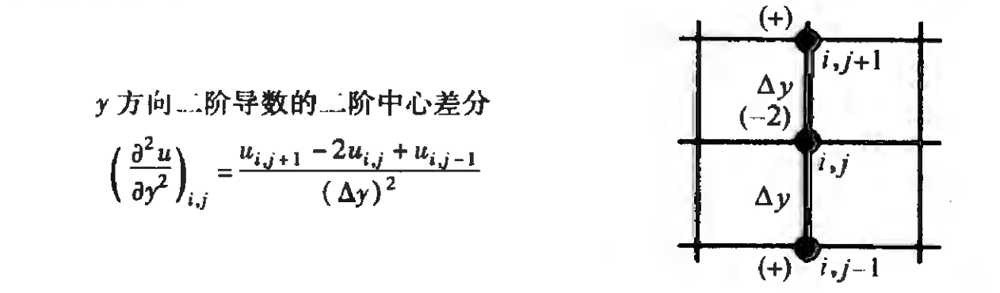
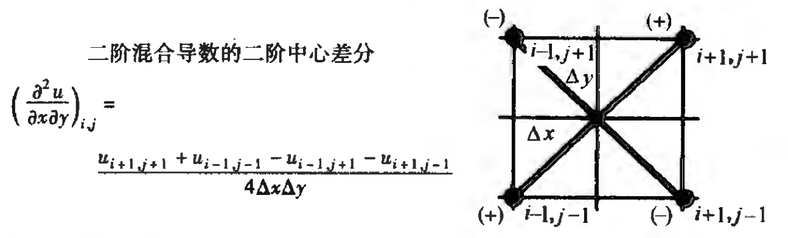

事实上，完全可以导出更高阶精度的差分，只需要在**不同网格点处反复使用泰勒展开**。但一般情况下，二阶精度已经足够了。

还有一个问题，如何在边界上求有限差分？比如，如图所示，如何求$(\frac{\partial u}{\partial y})_{i,1}$？很多情况下，不存在$u_{i,0},u_{i,-1}$，所以不能使用上面的公式。

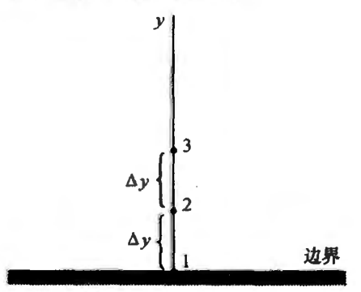

一种方案是使用**反射边界条件**，即假设
$$
u_{i,0}=u_{i,2}\\
u_{i,-1}=u_{i,3}
$$
但这种方法效果不好。

另一种方案是充分利用边界点周围的信息。假设在图中的边界上$u$可以表示成多项式
$$u=a+by+cy^2$$
那么
$$
\begin{aligned}
&u_{i,1}=a\\
&u_{i,2}=a+b\Delta y+c(\Delta y)^2\\
&u_{i,3}=a+b(2\Delta y)+c(2\Delta y)^2\\
\end{aligned}
$$
且有
$$
\left(\frac{\partial u}{\partial y}\right)_{i,1}=b=
\frac{-3u_{i,1}+4u_{i,2}-u_{i,3}}{2\Delta y}
$$
结合泰勒级数，可得出
$$
\boxed{\left(\frac{\partial u}{\partial y}\right)_{i,1}=
\frac{-3u_{i,1}+4u_{i,2}-u_{i,3}}{2\Delta y}+
\text{O}(\Delta y)^2}
$$

## 差分方程

回到前面给出的弦振动偏微分方程
$$
\left\{\begin{matrix} \begin{aligned}
&\frac{\partial^2 u}{\partial t^2}-a^2\frac{\partial^2 u}{\partial x^2}=0\quad(0<x<l)\\  
&u|_{x=0}=u|_{x=l}=0\\
&u|_{t=0}=0\\
&\frac{\partial u}{\partial t}|_{t=0}=v_0\delta(x-x_0)
\end{aligned}\end{matrix}\right.
$$
现在，把有限差分作用于这个偏微分方程。
$$
\left(\frac{\partial^{2} u}{\partial t^{2}}\right)_{n,i}=\frac{u_{n+1,i}-2 u_{n,i}+u_{n-1,i}}{(\Delta t)^{2}}+\text{O}(\Delta t)^{2}\\
\left(\frac{\partial^{2} u}{\partial x^{2}}\right)_{n,i}=\frac{u_{n,i+1}-2 u_{n,i}+u_{n,i-1}}{(\Delta x)^{2}}+\text{O}(\Delta x)^{2}
$$
可以化为
$$
u_{n+1,i}=2 u_{n,i}-u_{n-1,i}+
\frac{a^2(\Delta t)^2}{(\Delta x)^2}(u_{n,i+1}-2 u_{n,i}+u_{n,i-1})+
\text{O}\left[(\Delta t)^{2},(\Delta x)^{2}\right]
$$
这是一个**差分方程**，$\text{O}\left[(\Delta t)^{2},(\Delta x)^{2}\right]$为其**截断误差**。这个方程说明，只要知道了$u_{n,i}$和$u_{n-1,i}$，就可以求出$u_{n+1,i}$。也就是说，只要知道了$u_{0,i}$和$u_{1,i}$，就可以依次求出之后的$u_{n,i}$。

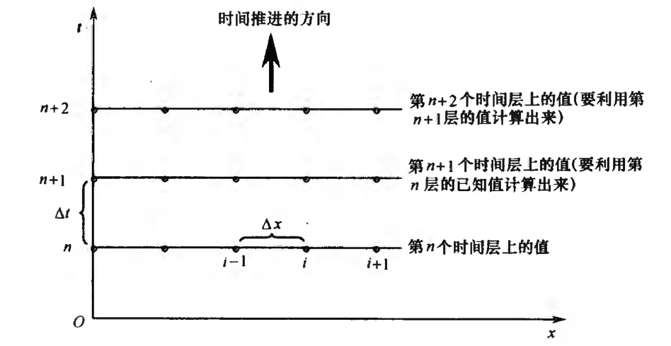

现在，可以把有限差分作用于偏微分方程的边界条件和初始条件了。对于边界条件，有
$$
\begin{aligned}
&N:=\frac{l}{\Delta x}\\
&0\leq i\leq N+1\\
&u_{n,0}=u_{n,N+1}=0
\end{aligned}
$$

对于初始条件，有
$$
\begin{aligned}
&k:=\frac{x_0}{\Delta x}\\
&n\geq 0\\
&u_{0,i}=0\\
&(\frac{\partial u}{\partial t})_{0,i}\approx
\frac{u_{1,i}-u_{0,i}}{\Delta t}=
\frac{v_0}{\Delta x}\delta_{ik}
\end{aligned}
$$
进一步，得
$$
u_{1,i}=\frac{v_0\Delta t}{\Delta x}\delta_{ik}
$$
于是，就获得了$u_{0,i}$和$u_{1,i}$。

总结一下
$$
\left\{\begin{aligned}
&u_{n+1,i}=2 u_{n,i}-u_{n-1,i}+
\frac{a^2(\Delta t)^2}{(\Delta x)^2}(u_{n,i+1}-2 u_{n,i}+u_{n,i-1})\\
&u_{n,0}=u_{n,N+1}=0\\
&u_{0,i}=0\\
&u_{1,i}=\frac{v_0\Delta t}{\Delta x}\delta_{ik}\\
&0\leq i\leq N+1\\
&n\geq 0\\
\end{aligned}\right.
$$

## Python求解差分方程

如上文所述，下面用Python写了求解弦振动方程的代码。代码运行后会得到弦的振动情况的gif动图。

```python
# %%
import numpy as np
from tqdm import tqdm
import matplotlib.pyplot as plt
import matplotlib.animation as animation


# %%
# 设置参数
f_a = 1.0
f_l = 1.0  # 绳长1m
f_x_0 = 0.3
f_v_0 = 1.0
f_delta_x = 0.001
f_delta_t = 0.001

i_N = int(f_l / f_delta_x)
i_k = int(f_x_0 / f_delta_x)

# u[n,i]的数据结构: list[dict{n,u[i]}]
array_u = []

# %%

# n=0,1
dict_u = {
    "n": 0,
    "vec": np.zeros(i_N+2)
}
array_u.append(dict_u)

dict_u = {
    "n": 1,
    "vec": np.zeros(i_N+2)
}
dict_u["vec"][i_k] = (f_v_0*f_delta_t)/f_delta_x
array_u.append(dict_u)


# %%

def u(n: int, i: int) -> float:
    """ 
    从array_u中读取[n,i]处的值
     """
    return array_u[n]["vec"][i]


def next_vec() -> np.array:
    """ 
    返回new_vec
     """
    new_vec = np.zeros(i_N+2)
    n = len(array_u)-1

    # 这里应用边界条件
    new_vec[0] = 0.0
    new_vec[i_N+1] = 0.0

    for i in range(1, i_N+1):
        new_vec[i] = 2*u(n, i)-u(n-1, i)+((f_a*f_a*f_delta_t*f_delta_t) /
                                          (f_delta_x**2))*(u(n, i+1)-2*u(n, i)+u(n, i-1))

    return new_vec

# %%


for iii in tqdm(range(10000)):
    dict_u = {
        "n": len(array_u),
        "vec": next_vec()
    }
    array_u.append(dict_u)

# %%
# plt.ion()
# for index, dict_u in enumerate(array_u):
#     if index % 100 == 0:
#         plt.clf()
#         plt.plot(dict_u["vec"])
#         plt.pause(0.1)

# %%
fig = plt.figure()
ims = []
for index, dict_u in enumerate(array_u):
    if index % 100 == 0:
        im=plt.plot(dict_u["vec"],color="blue")
        ims.append(im)

ani = animation.ArtistAnimation(fig, ims, interval=100, repeat_delay=1000)
ani.save("2_1.gif",writer='pillow')       
```
结果如下图所示。

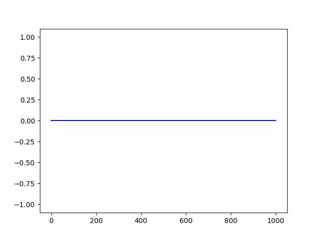

应用达朗贝尔公式，可以得出$u(t,x)$在没有边界条件下的解析解为
$$
u(t,x)=\frac{v_0}{2a}\left(H(x+at-x_0)-H(x-at-x_0)\right)
$$
其中$H(x)$为阶跃函数。结合弦波会在边界反弹的性质，分析可得解析解与数值解一致，故该求解偏微分方程方法有效。


## 参考资料
1. 美.约翰D.安德森 计算流体力学基础及其应用 2007
2. https://blog.csdn.net/qq_28888837/article/details/85778395
3. 梁昆淼 数学物理方法（第四版）

