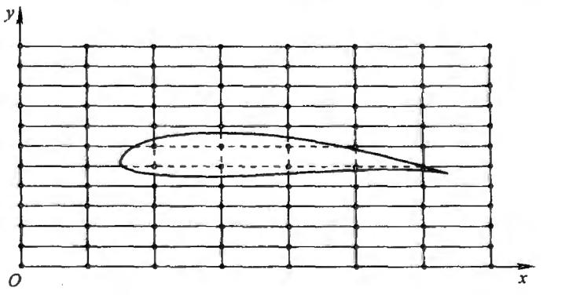
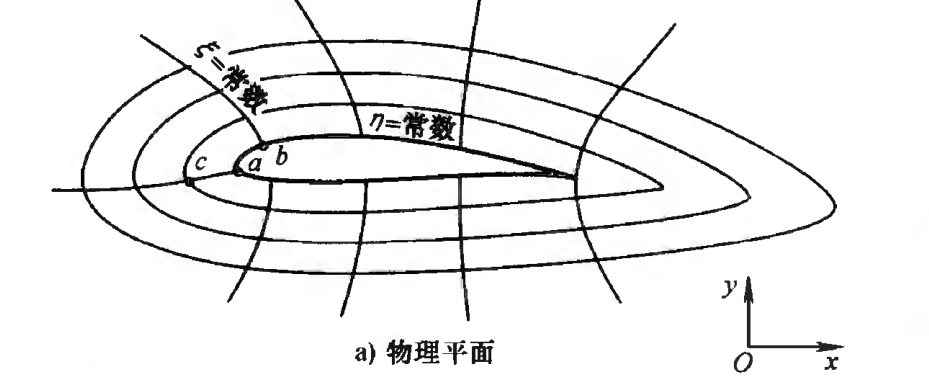
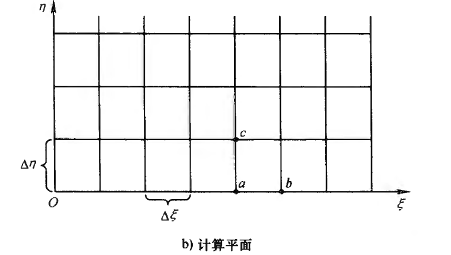
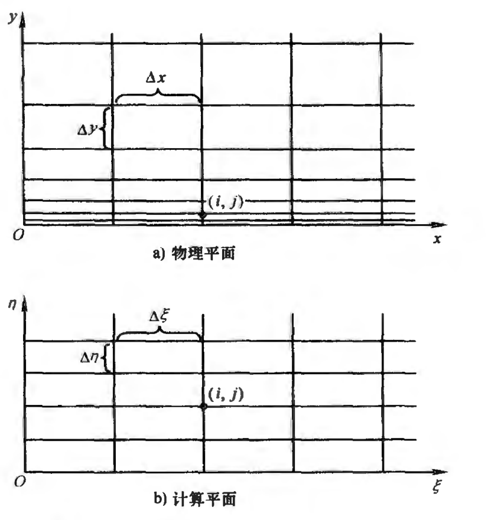
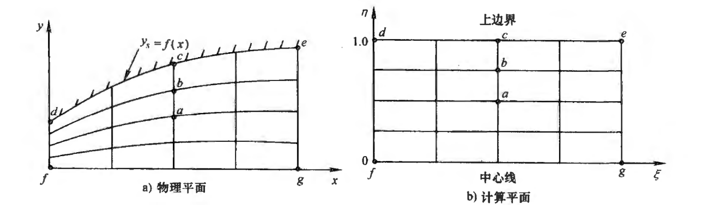
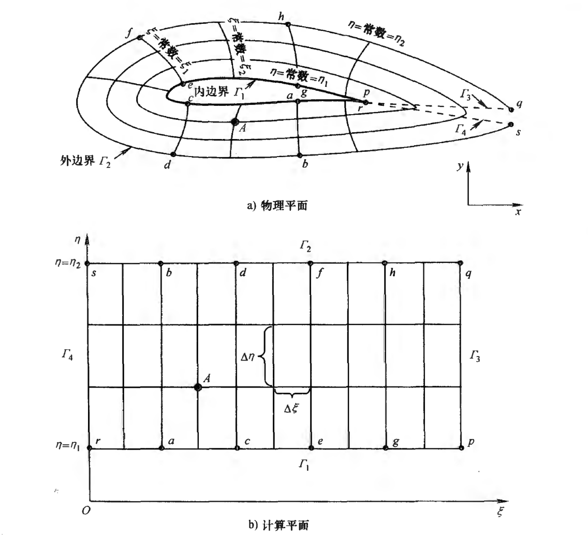

#! https://zhuanlan.zhihu.com/p/600219849
# 计算流体力学（五）网格生成与坐标变换

## 坐标与方程的变换

### 坐标变换

之前的文章[计算流体力学（二）有限差分](https://zhuanlan.zhihu.com/p/599416488)介绍了用一组网格上的离散点$(x_i,y_j)$代替物理空间内连续的点，且这个网格是由一个个矩形组成。但这个方法有较大的局限性。比如，如图所示

大部分网格点没有落在边界上，边界条件确定难以应用。物面显然需要更多的计算资源，但图中物面和其它地方的网格密度一样。

这些问题迫使我们采用其它的网格，如图

图中有两个曲线族，一个是$\xi=\xi(x,y)$，另一个是$\eta=\eta(x,y)$。这两个曲线族的交点便是网格点。

问题是之前的有限差分方法只适用于简单的矩形网格。为了解决这个问题，就要用到坐标变换。采用如下所示的坐标变换
$$
\begin{array}{l}
\xi=\xi(x,y,t)\\
\eta=\eta(x,y,t)\\
\tau=\tau(t)   
\end{array}\tag{5-1}
$$
那么该坐标表示的平面如下图所示，称为**计算平面**，相对应的，上图所示平面称为**物理平面**。

计算平面的网格是简单的矩形，因此可以用有限差分法。

## 方程变换

(5-1)所示的坐标变换过后，就要进行控制方程的变换。

结合微积分所学知识，有
$$
\begin{array}{l}
\frac{\partial}{\partial x}=\left(\frac{\partial}{\partial \xi}\right)\left(\frac{\partial \xi}{\partial x}\right)+\left(\frac{\partial}{\partial \eta}\right)\left(\frac{\partial \eta}{\partial x}\right)\\
\frac{\partial}{\partial y}=\left(\frac{\partial}{\partial \xi}\right)\left(\frac{\partial \xi}{\partial y}\right)+\left(\frac{\partial}{\partial \eta}\right)\left(\frac{\partial \eta}{\partial y}\right)\\
\frac{\partial}{\partial t}=\left(\frac{\partial}{\partial \xi}\right)\left(\frac{\partial \xi}{\partial t}\right)+\left(\frac{\partial}{\partial \eta}\right)\left(\frac{\partial \eta}{\partial t}\right)+\left(\frac{\partial}{\partial \tau}\right)\left(\frac{\mathrm{d} \tau}{\mathrm{d} t}\right)\\
\frac{\partial^{2}}{\partial x^{2}}= \left(\frac{\partial}{\partial \xi}\right)\left(\frac{\partial^{2} \xi}{\partial x^{2}}\right)+\left(\frac{\partial}{\partial \eta}\right)\left(\frac{\partial^{2} \eta}{\partial x^{2}}\right)+\left(\frac{\partial^{2}}{\partial \xi^{2}}\right)\left(\frac{\partial \xi}{\partial x}\right)^{2}+\left(\frac{\partial^{2}}{\partial \eta^{2}}\right)\left(\frac{\partial \eta}{\partial x}\right)^{2}+ 2\left(\frac{\partial^{2}}{\partial \eta \partial \xi}\right)\left(\frac{\partial \eta}{\partial x}\right)\left(\frac{\partial \xi}{\partial x}\right)\\
\frac{\partial^{2}}{\partial y^{2}}= \left(\frac{\partial}{\partial \xi}\right)\left(\frac{\partial^{2} \xi}{\partial y^{2}}\right)+\left(\frac{\partial}{\partial \eta}\right)\left(\frac{\partial^{2} \eta}{\partial y^{2}}\right)+\left(\frac{\partial^{2}}{\partial \xi^{2}}\right)\left(\frac{\partial \xi}{\partial y}\right)^{2}+ \left(\frac{\partial^{2}}{\partial \eta^{2}}\right)\left(\frac{\partial \eta}{\partial y}\right)^{2}+2\left(\frac{\partial^{2}}{\partial \eta \partial \xi}\right)\left(\frac{\partial \eta}{\partial y}\right)\left(\frac{\partial \xi}{\partial y}\right)\\
\frac{\partial^{2}}{\partial x \partial y}= \left(\frac{\partial}{\partial \xi}\right)\left(\frac{\partial^{2} \xi}{\partial x \partial y}\right)+\left(\frac{\partial}{\partial \eta}\right)\left(\frac{\partial^{2} \eta}{\partial x \partial y}\right)+\left(\frac{\partial^{2}}{\partial \xi^{2}}\right)\left(\frac{\partial \xi}{\partial x}\right)\left(\frac{\partial \xi}{\partial y}\right)+ \left(\frac{\partial^{2}}{\partial \eta^{2}}\right)\left(\frac{\partial \eta}{\partial x}\right)\left(\frac{\partial \eta}{\partial y}\right)+\left(\frac{\partial^{2}}{\partial \xi \partial \eta}\right)\left[\left(\frac{\partial \eta}{\partial x}\right)\left(\frac{\partial \xi}{\partial y}\right)+\left(\frac{\partial \xi}{\partial x}\right)\left(\frac{\partial \eta}{\partial y}\right)\right]
\end{array}\tag{5-2}
$$

将这些代入控制方程，就实现了在计算平面上求解控制方程。

此外，有时候，我们得到的坐标变换是
$$
\begin{array}{l}
x=x(\xi,\eta)\\
y=y(\xi,\eta)
\end{array}\tag{5-3}
$$

这时候，有
$$
\begin{array}{l}
\frac{\partial \xi}{\partial x}=\frac{1}{J} \frac{\partial y}{\partial \eta} \\
\frac{\partial \eta}{\partial x}=-\frac{1}{J} \frac{\partial y}{\partial \xi} \\
\frac{\partial \xi}{\partial y}=-\frac{1}{J} \frac{\partial x}{\partial \eta} \\
\frac{\partial \eta}{\partial y}=\frac{1}{J} \frac{\partial x}{\partial \xi}
\end{array}\tag{5-4}
$$
其中$J$为雅克比行列式
$$
J \equiv \frac{\partial(x, y)}{\partial(\xi, \eta)} \equiv\left|\begin{array}{ll}
\frac{\partial x}{\partial \xi} & \frac{\partial y}{\partial \xi} \\
\frac{\partial x}{\partial \eta} & \frac{\partial y}{\partial \eta}
\end{array}\right|
\tag{5-5}
$$

## 网格生成

这里探讨变换表达式(5-1)的具体情形。

### 拉伸（压缩）网格

这个网格适用于底部为物面的情况。此时坐标变换为
$$
\begin{array}{l}
\xi=x\\
\eta=ln(y+1)
\end{array}\tag{5-6}
$$
其逆变换为
$$
\begin{array}{l}
x=\xi\\
y=e^{\eta}-1
\end{array}\tag{5-7}
$$

### 贴体网格

这里的物面为函数$f(x)$的图形。可以采取变换
$$
\begin{array}{l}
\xi=x\\
\eta=\frac{y}{f(x)}
\end{array}\tag{5-8}
$$

### 椭圆网格生成

而对于下图所示的情况，即物理过程发生在内边界$\Gamma_1$与外边界$\Gamma_2$之间。

这时变换的表达式，需要由解椭圆型偏微分方程确定，即
$$
\begin{array}{l}
\frac{\partial^{2} \xi}{\partial x^{2}}+\frac{\partial^{2} \xi}{\partial y^{2}}=0 \\
\frac{\partial^{2} \eta}{\partial x^{2}}+\frac{\partial^{2} \eta}{\partial y^{2}}=0
\end{array}\tag{5-9}
$$
该偏微分方程边界条件，由内外边界具体情况确定。

<未完继续>

## 参考资料
1. 美.约翰D.安德森 计算流体力学基础及其应用 2007

[目录](https://zhuanlan.zhihu.com/p/599909213)