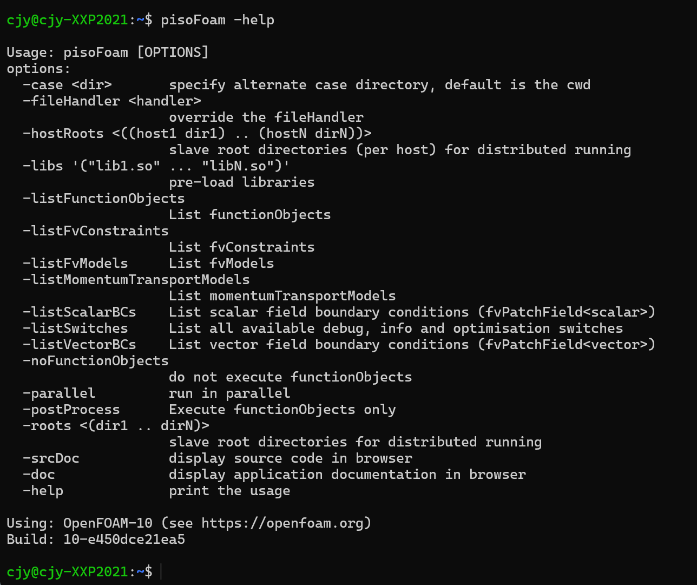
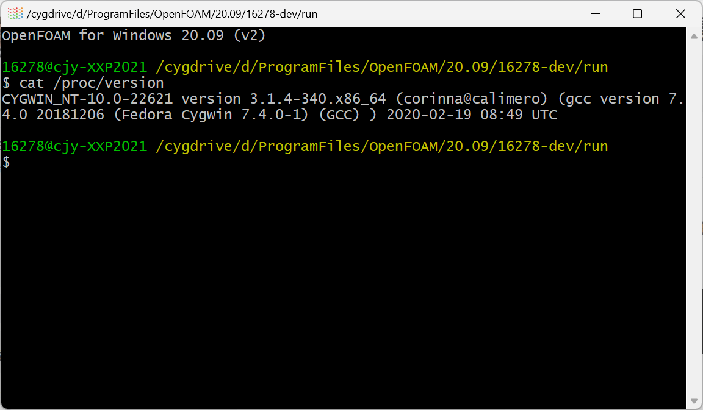
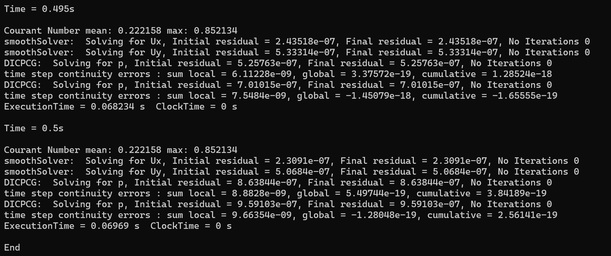
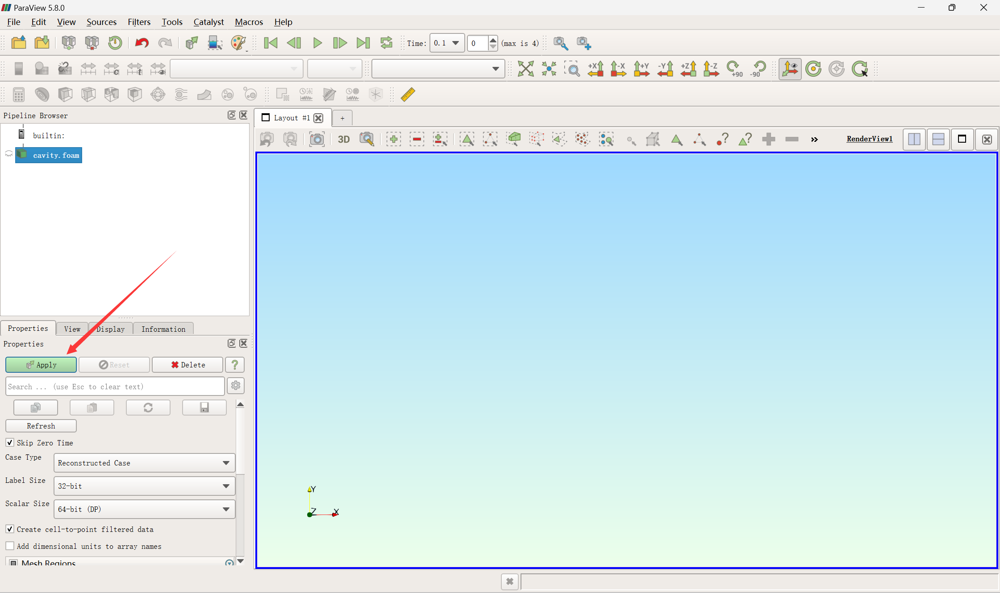
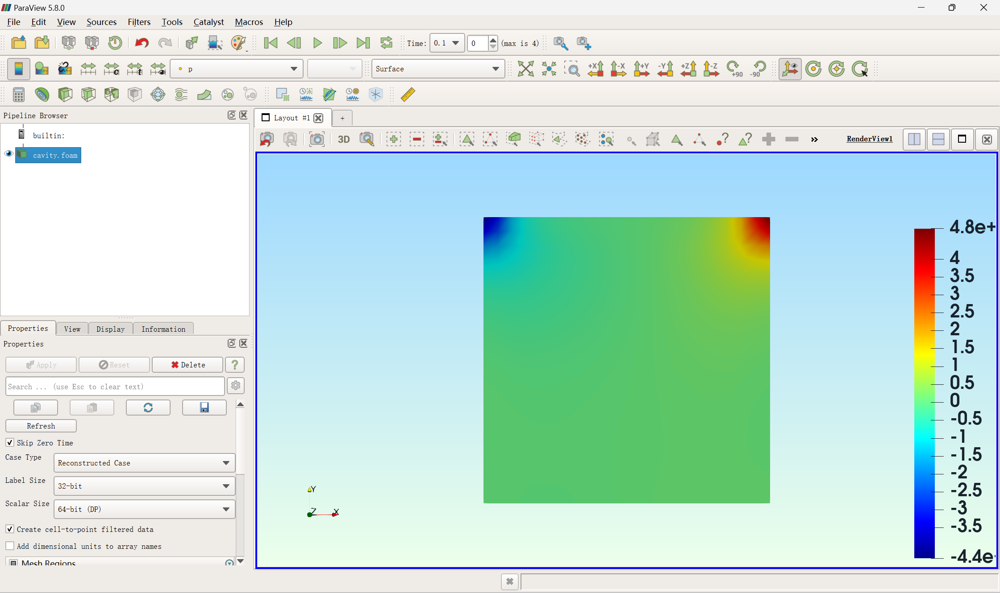

#! https://zhuanlan.zhihu.com/p/601418292
# 计算流体力学（六）OpenFOAM安装

OpenFOAM是用于处理cfd问题的开源软件，是在cfd学习过程中必然使用到的软件工具。这里介绍OpenFOAM的安装与简单使用。OpenFOAM能在各个系统上运行，这里仅说Linux系统和Windows系统。


## linux安装OpenFOAM

### 安装Linux环境

如果是国产linux系统，比如Deepin、优麒麟等，可以直接进行下一步。

如果按装的是ubuntu等非国产linux系统，由于网络原因，这些系统内置软件包管理器不能更新或下载软件。因此需要换源操作。简单来说，就是让系统软件访问国内的服务器而不是国外的。具体方法可以参考[清华大学镜像站的教程](https://mirrors.tuna.tsinghua.edu.cn/help/ubuntu/)，直接在终端执行命令替换中的命令。

如果想要在Windows中运行linux版的OpenFOAM，有两种方案。一种是安装虚拟机软件，这里推荐VMware。另一种是安装WSL2，具体参考[微软官方教程](https://learn.microsoft.com/zh-cn/windows/wsl/)。

### linux安装OpenFOAM

OpenFOAM有很多个版本，**这里给出OpenFOAM v10的安装教程**。当然，[官网也给出了教程](https://openfoam.org/download/10-ubuntu/)。但是与ubuntu一样，OpenFOAM的安装需要换源。这里使用[常恭大佬提供的镜像站](https://www.cfdem.cn/openfoam-mirror/)。

直接在终端输入以下命令。
```bash
sudo sh -c "wget -O - https://dl.openfoam.org/gpg.key | apt-key add -"
sudo add-apt-repository http://dl.cfdem.cn/ubuntu
sudo apt-get update
sudo apt-get -y install openfoam10
sudo apt install paraview
```
然后OpenFOAM v10就安装完成了。之后是添加环境变量。运行以下命令
```bash
cat /opt/openfoam10/etc/bashrc >> ~/.bashrc
source ~/.bashrc
```
之后运行`pisoFoam -help`，如果结果如下，初步说明安装完成了。


## windows安装OpenFOAM

这里要用到of4win这个软件。注意这个软件只建议在初学OpenFOAM时使用。安装网站为https://www.cfdsupport.com/openfoam-for-windows.html

需要填写一些个人信息后才能获取安装地址。这里也提供了百度网盘

链接：https://pan.baidu.com/s/1Fd2VJLlh9ZcpTYVNd_baXw?pwd=1234 
提取码：1234

下载后直接双击安装，期间会经历一次重启。然后会提示你安装其他软件，全部安装即可。

安装完成后，桌面会有如图所示的图标


双击打开，界面如图



在该命令行界面中操作与linux一致。

## 第一个算例

参考https://doc.cfd.direct/openfoam/user-guide-v10/cavity

将示例中的cavity算例复制到`$FOAM_RUN`目录中。
```bash
mkdir -p $FOAM_RUN
cp -r $FOAM_TUTORIALS/incompressible/icoFoam/cavity/cavity $FOAM_RUN
cd $FOAM_RUN/cavity/
```

在`$FOAM_RUN/cavity/`目录运行如下命令
```bash
blockMesh
icoFoam
paraFoam
```

终端结果如下。这是计算结果。



并且会打开一个窗口，如下图



点击Apply按钮，结果如图。这是后处理产生的图像。




## 注意事项

wsl2中使用paraFoam命令会遇到`Mesa warning: Window xxxxxxxx has no colormap!`警告，后处理显示失败。这时候可以用Windows版的OpenFOAM进行后处理。


<未完待续>

## 参考资料
1. https://zhuanlan.zhihu.com/p/85092318
2. https://cfd-china.com/category/6/openfoam
3. http://dyfluid.com/
4. https://www.cfdem.cn/openfoam-mirror/
5. https://doc.cfd.direct/openfoam/user-guide-v10/
6. https://www.bilibili.com/video/BV14S4y1c7NS
7. https://www.bilibili.com/video/BV1m3411f7eK

[目录](https://zhuanlan.zhihu.com/p/599909213)