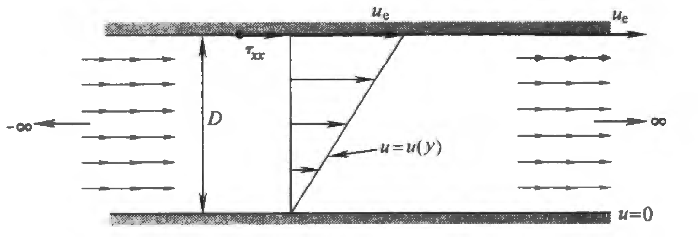
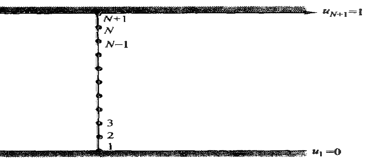
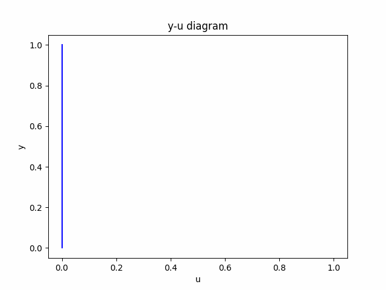

#! https://zhuanlan.zhihu.com/p/600043678
# 计算流体力学（四）不可压库艾特流的数值解

## 库埃特流动
库埃特流动问题定义如下：设有两个相距为$D$的平行平板，上面的平板以速度$u_e$运动，下面的平板静止，速度$u=0$。考虑这两个平板之间的粘性流动，最终稳态是什么？



记在横截面上的速度剖面随时间变化为$u(t,y)$，则有边界条件
$$u(t,0)=0\quad u(t,D)=u_e\quad y\in [0,D]\tag{4-1}$$
此外，初值条件为
$$u(0,y)=0\tag{4-2}$$
控制方程是
$$
\rho \frac{\partial u}{\partial t}=\mu \frac{\partial^{2} u}{\partial y^{2}}\tag{4-3}
$$

一个可以简化计算的方法是把变量表示为无量纲的形式，即
$$
u^{\prime}=\frac{u}{u_{e}} \quad y^{\prime}=\frac{y}{D} \quad t^{\prime}=\frac{t}{D / u_{e}}\tag{4-4}
$$

则定解问题变成
$$
\left\{\begin{matrix} \begin{aligned}
&\frac{\partial u}{\partial t}-\frac{1}{R_e}\frac{\partial^2 u}{\partial y^2}=0\quad y\in [0,1]\\  
&u(t,0)=0\quad u(t,1)=1\\
&u(0,y)=0\\
\end{aligned}\end{matrix}\right.\tag{4-5}
$$
其中$R_e:=\frac{\rho u_e D}{\mu}$，利用分离变数法可得解析解
$$
u(t,y)=y+\sum_{n=1}^{\infty}\frac{2(-1)^n}{\pi n}e^{-\frac{\pi^2n^2}{R_e}t}sin\pi ny \tag{4-6}
$$
也就是说，在无量纲的情况下，库埃特流动的稳态为$u(y)=y$。接下来的数值解要与解析解做比较。

## 数值解法

考虑数值求解思路：对定解问题(4-5)进行有限差分，然后计算足够多的时间步，最终得到稳态解。由于达到稳态的时间是一定的，故为了减少计算量，就要让$\Delta t$尽可能大。而隐式方法允许取较大的$\Delta t$值，故这里采用隐式方法求解。

采取网格划分$(t_n,y_j)$，用$u_j^n$代替$u(t,y)$。根据克兰克-尼科尔森格式，有
$$
\frac{u_{j}^{n+1}-u_{j}^{n}}{\Delta t}=\frac{1}{R_e} \frac{\frac{1}{2}\left(u_{j+1}^{n+1}+u_{j+1}^{n}\right)+\frac{1}{2}\left(-2 u_{j}^{n+1}-2 u_{j}^{n}\right)+\frac{1}{2}\left(u_{j-1}^{n+1}+u_{j-1}^{n}\right)}{(\Delta y)^{2}}\tag{4-7}
$$
整理可得
$$
\begin{aligned}
&\left[-\frac{\Delta t}{2(\Delta y)^{2} R_e}\right] u_{j-1}^{n+1}+\left[1+\frac{\Delta t}{(\Delta y)^{2} R_e}\right] u_{j}^{n+1}+\left[-\frac{\Delta t}{2(\Delta y)^{2} R_e}\right] u_{j+1}^{n+1}\\
&=\left[1-\frac{\Delta t}{(\Delta y)^{2} R_e}\right] u_{j}^{n}+\frac{\Delta t}{2(\Delta y)^{2} R_e}\left(u_{j+1}^{n}+u_{j-1}^{n}\right)
\end{aligned}\tag{4-8}
$$
进一步简化该式，将其表达成
$$
\boxed{A u_{j-1}^{n+1}+B u_{j}^{n+1}+A u_{j+1}^{n+1}=K_{j}}\tag{4-9}
$$
其中
$$
\begin{array}{c}
A=-\frac{\Delta t}{2(\Delta y)^{2} R_e} \\
B=1+\frac{\Delta t}{(\Delta y)^{2} R_e} \\
K_{j}=\left[1-\frac{\Delta t}{(\Delta y)^{2} R_e}\right] u_{j}^{n}+\frac{\Delta t}{2(\Delta y)^2 R_e}\left(u_{j+1}^{n}+u_{j-1}^{n}\right)
\end{array}\tag{4-10}
$$

接下来就是建立方程组，通过$u_j^n$求$u_{j}^{n+1}$了。



如图划分网格，将区间$[0,1]$$N$等分，则有
$$
\begin{array}{l}
y_0=0\\
y_{N+1}=1\\
\Delta y=\frac{1}{N}
\end{array}\tag{4-11}
$$
根据边界条件
$$
\begin{array}{l}
u_1^n=0\\
u_{N+1}^n=1
\end{array}\tag{4-12}
$$
则可按照公式(4-9)写出线性方程组
$$
\begin{array}{l}
B u_{2}^{n+1}+A u_{3}^{n+1}=K_{2}\\
A u_{j-1}^{n+1}+B u_{j}^{n+1}+A u_{j+1}^{n+1}=K_{j}\quad (j=3,4,\cdots N-1)\\
A u_{N-1}^{n+1}+B u_{N}^{n+1}+A=K_{N}
\end{array}\tag{4-13}
$$
矩阵形式
$$
\left(\begin{array}{ccccccccc}
B & A & 0 & 0 & 0 & 0 & 0 & 0 & 0 \\
A & B & A & 0 & 0 & 0 & 0 & 0 & 0 \\
0 & A & B & A & 0 & 0 & 0 & 0 & 0 \\
0 & 0 & A & B & A & 0 & 0 & 0 & 0 \\
& & & \cdots & & & & & \\
& & & & \cdots & & & & \\
& & & & & \cdots & & & \\
0 & 0 & 0 & 0 & 0 & 0 & A & B & A \\
0 & 0 & 0 & 0 & 0 & 0 & 0 & A & B
\end{array}\right)\left(\begin{array}{c}
u_{2}^{n+1} \\
u_{3}^{n+1} \\
u_{4}^{n+1} \\
u_{5}^{n+1} \\
\vdots \\
u_{N-1}^{n+1} \\
u_{N}^{n+1}
\end{array}\right)=\left(\begin{array}{c}
K_{2} \\
K_{3} \\
K_{4} \\
K_{5} \\
\vdots \\
K_{N-1} \\
K_{N}-A
\end{array}\right)\tag{4-14}
$$
则有
$$
\left(\begin{array}{c}
u_{2}^{n+1} \\
u_{3}^{n+1} \\
u_{4}^{n+1} \\
u_{5}^{n+1} \\
\vdots \\
u_{N-1}^{n+1} \\
u_{N}^{n+1}
\end{array}\right)=
\left(\begin{array}{ccccccccc}
B & A & 0 & 0 & 0 & 0 & 0 & 0 & 0 \\
A & B & A & 0 & 0 & 0 & 0 & 0 & 0 \\
0 & A & B & A & 0 & 0 & 0 & 0 & 0 \\
0 & 0 & A & B & A & 0 & 0 & 0 & 0 \\
& & & \cdots & & & & & \\
& & & & \cdots & & & & \\
& & & & & \cdots & & & \\
0 & 0 & 0 & 0 & 0 & 0 & A & B & A \\
0 & 0 & 0 & 0 & 0 & 0 & 0 & A & B
\end{array}\right)^{-1}
\left(\begin{array}{c}
K_{2} \\
K_{3} \\
K_{4} \\
K_{5} \\
\vdots \\
K_{N-1} \\
K_{N}-A
\end{array}\right)\tag{4-15}
$$
这就实现了通过$u_j^n$求$u_{j}^{n+1}$。之后就可以和[计算流体力学（二）有限差分](https://zhuanlan.zhihu.com/p/599416488)这篇文章一样，一步一步得到解析解。

## 误差与稳定性分析

首先，差分格式(4-8)显然满足相容性。事实上，相容性条件是一个非常弱的条件。

之后分析稳定性。采用[计算流体力学（三）差分方程](https://zhuanlan.zhihu.com/p/599619784)这篇文章提到的傅里叶变换法，可以发现差分格式(4-8)的稳定性是无条件成立的。而这正是隐式方法的优点。

最后根据Lax等价定理，证明满足收敛性。

采用隐式方法，是为了让$\Delta t$尽可能大。那么当$\Delta t$增大时，数值解精度如何？可以做一个实验。首先提出衡量$\Delta t$大小的指标$E$
$$E=\frac{\Delta t}{R_e (\Delta y)^2}\tag{4-16}$$
下面将用Python求解定值问题，并观察$E$的大小对求解精度的影响。

## Python求解

取$R_e=5000,N=20$，且运行的总时间用无量纲表示为$t=3200$。

Python求解代码如下
```Python
# %%
from typing import List

import matplotlib.animation as animation
import matplotlib.pyplot as plt
import numpy as np
from tqdm import tqdm

# %%
# 设置参数
gif_name="E1"

f_E: float = 1
f_R_e: float = 5000.0
f_Time: float = 3200.0  # 运行的总时间
i_N: int = 20


f_delta_y: float = 1/i_N
f_delta_t: float = f_E*f_R_e*(f_delta_y*f_delta_y)

# u[n,j]的数据结构: list[np.array(N+1)]
array_u: List = []

# %%
# 初值条件
vec_temp = np.zeros(i_N+1)
array_u.append(vec_temp)

# %%


def u(n: int, j: int) -> float:
    """ 
    从array_u中读取[n,j]处的值
     """
    return array_u[n][j-1]


def K(n: int, j: int) -> float:
    """ 
    计算K_j^n
     """
    result = (1-f_E)*u(n, j)+(f_E/2)*(u(n, j+1)+u(n, j-1))
    return result


f_A = -f_E/2
f_B = 1+f_E

vec_temp1 = np.ones(i_N-2)
vec_temp2 = np.ones(i_N-1)

matrix_T = (
    f_A*np.diagflat(vec_temp1, 1) +
    f_B * np.diagflat(vec_temp2, 0) +
    f_A*np.diagflat(vec_temp1, -1)
)
matrix_S = np.linalg.inv(matrix_T)


def next_step():
    """ 
    计算一个时间步
     """
    i_n: int = len(array_u)-1
    vec_K = np.array(list(map(
        lambda j: K(i_n, j) if j != i_N else K(i_n, j)-f_A,
        list(range(2, i_N+1))
    )))

    vec_temp = np.dot(matrix_S, vec_K)
    vec_temp = np.insert(vec_temp, 0, 0)
    vec_temp = np.append(vec_temp, 1)
    array_u.append(vec_temp)


# %%

for i in tqdm(range(int(f_Time/f_delta_t))):
    next_step()

step_num = len(array_u)
print("共{}个时间步".format(step_num))

# %%

gif_time = 2
gif_frame_count = 20

choices = np.linspace(0, step_num, gif_frame_count).astype("int").tolist()

vec_y = np.linspace(0, 1, i_N+1)
fig = plt.figure()
ims = []
for choice in choices:
    if (choice > step_num-1):
        choice = choice-1
    im = plt.plot(array_u[choice], vec_y, color="blue")
    plt.xlabel("u")
    plt.ylabel("y")
    plt.title("y-u diagram")
    ims.append(im)

print("正在生成gif……")

ani = animation.ArtistAnimation(
    fig, ims, interval=1000*(gif_time/gif_frame_count), repeat_delay=1000)
ani.save("{}.gif".format(gif_name), writer='pillow')

```

当$E=1$时，结果如图


当$E=4$时，结果如图


当$E=8$时，结果如图


当$E=16$时，结果如图


当$E=32$时，结果如图


可以看到，以上结果的稳态都近似于$u(y)=y$，这证明该偏微分求解方法有效。其中$E=8$时，趋近速度最快。因此$E=8$为最合适的值。

同时也可以看到，随着$E$的增大，精度有明显的下降。但由于稳定性的约束，仍旧趋向正确结果。

## 参考资料
1. 美.约翰D.安德森 计算流体力学基础及其应用 2007
2. 梁昆淼 数学物理方法（第四版）

[目录](https://zhuanlan.zhihu.com/p/599909213)

下一篇文章 [计算流体力学（五）网格生成与坐标变换](https://zhuanlan.zhihu.com/p/600219849)
